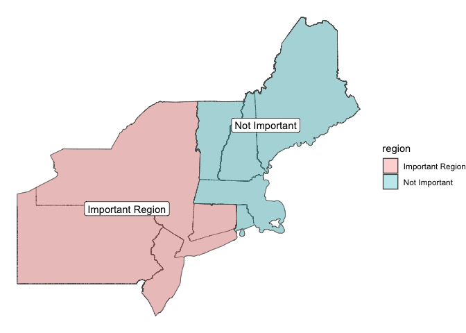
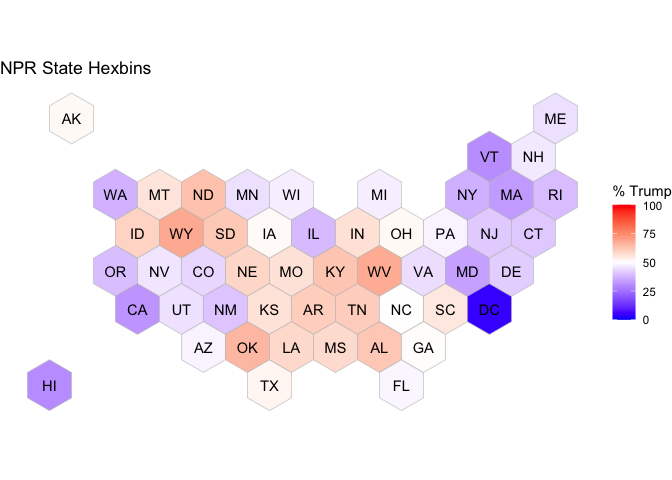
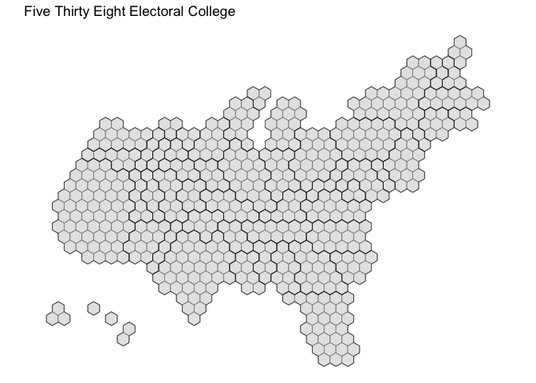

PPOL 6802 Week 10 - Geospatial
================
Alex Lundry
2024-03-16

There are several ways to create a map in R, but for the purposes of
this course, we will focus on just a few specific components of
map-making that you would find useful in the public policy world, and
then lean into map-making in Tableau. Here’s what we will be covering in
R:

- Types of Geographic Data
- Drawing Maps
- Choropleth maps
- Geocoding
- Creating custom regions
- Statebins/Hexbins

We’ll rely upon several packages along the way, but here are the first
you’ll need:

``` r
# all necessary libraries for this tutorial
# install.packages(c("tidyverse", "sf", "tigris", "tidygeocoder", "rnaturalearth", "rnaturalearthdata",
#                    "statebins", "socviz", "tilegramsR"))

library(tidyverse)
```

    ## ── Attaching core tidyverse packages ──────────────────────── tidyverse 2.0.0 ──
    ## ✔ dplyr     1.1.4     ✔ readr     2.1.5
    ## ✔ forcats   1.0.0     ✔ stringr   1.5.1
    ## ✔ ggplot2   3.4.4     ✔ tibble    3.2.1
    ## ✔ lubridate 1.9.3     ✔ tidyr     1.3.0
    ## ✔ purrr     1.0.2     
    ## ── Conflicts ────────────────────────────────────────── tidyverse_conflicts() ──
    ## ✖ dplyr::filter() masks stats::filter()
    ## ✖ dplyr::lag()    masks stats::lag()
    ## ℹ Use the conflicted package (<http://conflicted.r-lib.org/>) to force all conflicts to become errors

``` r
library(sf)
```

    ## Linking to GEOS 3.11.0, GDAL 3.5.3, PROJ 9.1.0; sf_use_s2() is TRUE

### Types of Geographic Data

Broadly, there are two types of geographic datasets that you are likely
to find yourself working with:

1.  A collection of specific locations on a map (think addresses or
    pairs of latitude and longitude)
2.  Data aggregated to a specific unit of geography like zip code, or
    county, or state or country (think presidendential election results
    at the state level)

#### Locations

Many times when you receive geographic data, it will come to you in the
form of text files, spreadsheets or databases that contain named
locations and some associated data. It may be something like the file
below, North Carolina voting locations in the 2022 election. We’ll read
it in (I had to get a little funky with the read-in command because a
straight up `read_csv` wasn’t working properly) and then use `glimpse`
to see what it looks like:

``` r
#  https://www.ncsbe.gov/results-data/polling-place-data
g1 <- read_delim("datasets/nc_boe/polling_place_20221108.csv", delim = "\t", 
                   locale = locale(encoding = "UTF-16LE"))
```

    ## Warning: One or more parsing issues, call `problems()` on your data frame for details,
    ## e.g.:
    ##   dat <- vroom(...)
    ##   problems(dat)

    ## Rows: 2655 Columns: 10
    ## ── Column specification ────────────────────────────────────────────────────────
    ## Delimiter: "\t"
    ## chr (7): election_dt, county_name, polling_place_name, precinct_name, street...
    ## dbl (3): polling_place_id, house_num, zip
    ## 
    ## ℹ Use `spec()` to retrieve the full column specification for this data.
    ## ℹ Specify the column types or set `show_col_types = FALSE` to quiet this message.

``` r
glimpse(g1)
```

    ## Rows: 2,655
    ## Columns: 10
    ## $ election_dt        <chr> "11/08/2022", "11/08/2022", "11/08/2022", "11/08/20…
    ## $ county_name        <chr> "ALAMANCE", "ALAMANCE", "ALAMANCE", "ALAMANCE", "AL…
    ## $ polling_place_id   <dbl> 1, 10, 12, 13, 14, 15, 16, 17, 18, 19, 2, 20, 22, 2…
    ## $ polling_place_name <chr> "ALAMANCE CIVITAN CLUB HOUSE", "ELMIRA COMMUNITY CE…
    ## $ precinct_name      <chr> "COBLE", "BURLINGTON 7", "NORTH BOONE", "FAUCETTE",…
    ## $ house_num          <dbl> 3328, 810, 621, 101, 2744, 508, 503, 311, 108, 110,…
    ## $ street_name        <chr> "DOCTOR PICKETT RD", "WICKER ST", "HAGGARD AVE", "B…
    ## $ city               <chr> "BURLINGTON", "BURLINGTON", "ELON", "BURLINGTON", "…
    ## $ state              <chr> "NC", "NC", "NC", "NC", "NC", "NC", "NC", "NC", "NC…
    ## $ zip                <dbl> 27215, 27217, 27244, 27217, 27215, 27215, 27253, 27…

#### Aggregated Geographic Data

These aren’t location points as in the NC board of elections data;
instead think of what election results might look like. Here are the
2020 presidential election results aggregated by media market:

``` r
dma_20 <- read_csv("datasets/dmas/dma_20_results.csv")
```

    ## Rows: 547 Columns: 7
    ## ── Column specification ────────────────────────────────────────────────────────
    ## Delimiter: ","
    ## chr (2): market, state
    ## dbl (5): biden_number, trump_number, other_number, biden_percent, trump_percent
    ## 
    ## ℹ Use `spec()` to retrieve the full column specification for this data.
    ## ℹ Specify the column types or set `show_col_types = FALSE` to quiet this message.

``` r
glimpse(dma_20)
```

    ## Rows: 547
    ## Columns: 7
    ## $ market        <chr> "Abilene", "Abilene", "Albany, GA", "Albany, GA", "Alban…
    ## $ state         <chr> "TX", "Total", "GA", "Total", "MA", "NY", "VT", "Total",…
    ## $ biden_number  <dbl> 24404, 24404, 65769, 65769, 51705, 333749, 12705, 398159…
    ## $ trump_number  <dbl> 100838, 100838, 99374, 99374, 18064, 282253, 7114, 30743…
    ## $ other_number  <dbl> 1727, 1727, 1342, 1342, 1606, 14235, 643, 16484, 533, 12…
    ## $ biden_percent <dbl> 0.1922044, 0.1922044, 0.3950446, 0.3950446, 0.7244133, 0…
    ## $ trump_percent <dbl> 0.7941939, 0.7941939, 0.5968946, 0.5968946, 0.2530858, 0…

There are no SPECIFIC locations here. Instead these data refer to
geographic units - in this case DMAs - and tells us the aggregated
performance of Biden and Trump within that territory.

*DMA stands for Designated Market Area, more commonly known as media
markets. It is essentially the broadcast television territory (what
city’s local news you get on the TV). These are common units of analysis
for political campaigns because of the massive amount of broadcast
television advertising they purchase.*

#### Shape Files

The problem with both of the above datasets is that our computer has no
idea how to draw anything associated with them. Yes it has fields like
`state` and `zip` but these are insufficient to draw a map. If we told
ggplot to visualize the state field, it doesn’t “know” what the state of
Virginia looks like and how to draw it. We need to somehow get the data
attached to ANOTHER dataset that has information on how to draw the
geography.

This brings us to the other type of geographic data you will be working
with:

- Spatial files, such as a shapefile or geoJSON file that contain actual
  geometries (points, lines or polygons).

Here’s what one part of a shapefile looks like:

``` r
dma <- st_read("datasets/dmas/NatDMA.shp")
```

    ## Reading layer `NatDMA' from data source 
    ##   `/Users/alexlundry/Dropbox/Teaching/PPOL 6802/ppol6802_spring24_code/code_demos/datasets/dmas/NatDMA.shp' 
    ##   using driver `ESRI Shapefile'
    ## Simple feature collection with 211 features and 13 fields
    ## Geometry type: MULTIPOLYGON
    ## Dimension:     XY
    ## Bounding box:  xmin: -179.1473 ymin: -14.55255 xmax: 179.7785 ymax: 71.35256
    ## Geodetic CRS:  WGS 84

``` r
glimpse(dma)
```

    ## Rows: 211
    ## Columns: 14
    ## $ Key       <chr> "000", "500", "501", "502", "503", "504", "505", "506", "507…
    ## $ AFFGEOID  <chr> "0100000US", NA, NA, NA, NA, NA, NA, NA, NA, NA, NA, NA, NA,…
    ## $ GEOID     <chr> "US", NA, NA, NA, NA, NA, NA, NA, NA, NA, NA, NA, NA, NA, NA…
    ## $ NAME      <chr> "National", "Portland-Auburn ME", "New York NY", "Binghamton…
    ## $ AreaSqKm  <dbl> 9366258.397, 29159.563, 30526.991, 9335.196, 22691.615, 2102…
    ## $ AreaSqMi  <dbl> 3616332.585, 11258.570, 11786.537, 3604.339, 8761.282, 8116.…
    ## $ CentroidX <dbl> -112.93516, -70.57117, -74.17695, -75.49106, -83.33290, -75.…
    ## $ CentroidY <dbl> 45.69911, 44.34196, 41.11623, 42.26049, 32.57213, 39.91159, …
    ## $ LengthKm  <dbl> 66355.8119, 4151.8496, 4792.5360, 620.4111, 895.4228, 2237.3…
    ## $ LengthMi  <dbl> 41231.5899, 2579.8397, 2977.9438, 385.5056, 556.3899, 1390.1…
    ## $ NumParts  <dbl> 290, 769, 614, 1, 2, 214, 111, 197, 187, 1, 1, 6, 33, 54, 32…
    ## $ PeanoKey  <dbl> -6.159124e+16, -6.156732e+16, -6.156817e+16, -6.156772e+16, …
    ## $ ObjType   <chr> "Polygon", "Polygon", "Polygon", "Polygon", "Polygon", "Poly…
    ## $ geometry  <MULTIPOLYGON [°]> MULTIPOLYGON (((179.4825 51..., MULTIPOLYGON ((…

Notice a few interesting features of the data:

- It is a special type of dataset called a “simple feature collection”
- It has a lot of associated metadata with it, including something
  called a “geodetic CRS”
- Each row appears to be a distinct unit of geography that has data like
  its length in miles associated with it.
- Each row contains a polygon, and there is a field called `geometry`
  that is labeled as a multipolygon.

Let’s look at one of those geometry fields up close:

    ##            [,1]     [,2]
    ##  [1,] -70.74656 43.08286
    ##  [2,] -70.74657 43.08281
    ##  [3,] -70.74659 43.08277
    ##  [4,] -70.74664 43.08273
    ##  [5,] -70.74676 43.08266
    ##  [6,] -70.74690 43.08260
    ##  [7,] -70.74698 43.08258
    ##  [8,] -70.74711 43.08258
    ##  [9,] -70.74727 43.08264
    ## [10,] -70.74740 43.08266
    ## [11,] -70.74748 43.08266
    ## [12,] -70.74763 43.08262
    ## [13,] -70.74778 43.08254
    ## [14,] -70.74784 43.08252
    ## [15,] -70.74789 43.08253
    ## [16,] -70.74795 43.08255
    ## [17,] -70.74805 43.08263
    ## [18,] -70.74809 43.08268
    ## [19,] -70.74806 43.08272
    ## [20,] -70.74785 43.08274
    ## [21,] -70.74774 43.08277
    ## [22,] -70.74709 43.08300
    ## [23,] -70.74703 43.08302
    ## [24,] -70.74679 43.08306
    ## [25,] -70.74672 43.08306
    ## [26,] -70.74668 43.08305
    ## [27,] -70.74661 43.08300
    ## [28,] -70.74658 43.08296
    ## [29,] -70.74656 43.08286

It’s a collection of coordinates! Shape files are basically EXTREMELY
detailed drawing instructions that we give to our computers: draw a line
from this point to this point, and then from this point to this point,
and so on, until we have a multipoint polygon shape that is the area we
are visualizing! Unlike the previous data, where the computer would have
no idea what to draw, here it knows exactly what to draw.

A shapefile encodes points, lines, and polygons in geographic space, and
is actually a set of files. Shapefiles appear with a .shp extension,
sometimes with accompanying files ending in .dbf and .prj.

When importing a shapefile, you need to ensure all the files are in the
same folder. This is the complete shapefile. If any of these files are
missing, you will get an error importing your shapefile.

### Drawing Maps

In order to read shape files, we’ll be using the **sf** library, which
is an incredibly useful way to create maps in R. There are many other
ways to draw maps in R, but the **sf** package gives us the best mix of
simplicity and robust functionality as well as integration into ggplot.

(If you’re like me and need to know what things stand for, sf stands for
“simple features” which refers to a formal standard (ISO 19125-1:2004)
that describes how objects in the real world can be represented in
computers. Also, most of the functions in this package starts with
prefix **st\_** which stands for *spatial and temporal.*)

For this demo, we’ll work with a shapefile for DMAs. Here’s what’s
happening in the code below:

- We use the `st_read()` function to turn a shapefile into a dataframe
  that is easier to work with.  
- We are taking the DMA name and pulling out the last 2 characters,
  which tells us the primary state associated with the DMA
- We are limiting the DMAs displayed to only the continental United
  States (CONUS) - sorry Hawaii and Alaska.  
- We are also removing the “National” DMA that covers the full country.
- Finally, we are changing the underlying map projection using the
  `st_transform` function and telling it the projection we’d like it to
  use. All shape files come pre-associated with a distinct projection.
  I’ll talk in more detail about this below.

``` r
dma <- st_read("datasets/dmas/NatDMA.shp")
```

    ## Reading layer `NatDMA' from data source 
    ##   `/Users/alexlundry/Dropbox/Teaching/PPOL 6802/ppol6802_spring24_code/code_demos/datasets/dmas/NatDMA.shp' 
    ##   using driver `ESRI Shapefile'
    ## Simple feature collection with 211 features and 13 fields
    ## Geometry type: MULTIPOLYGON
    ## Dimension:     XY
    ## Bounding box:  xmin: -179.1473 ymin: -14.55255 xmax: 179.7785 ymax: 71.35256
    ## Geodetic CRS:  WGS 84

``` r
dma_conus <- dma %>% 
   mutate(state_prime = str_sub(NAME, start = -2)) %>% 
   filter(!state_prime %in% c("HI", "AK"),
          NAME != "National") %>% 
   st_transform('EPSG:6350')
```

In the `st_transform` function, the information we gave it was obtained
from EPSG.org\[<https://epsg.org>\] which has a collection of
standardized map projections. You use the search function to tell it the
projection you like and the general geographic area you are visualizing.
It will tell you the code that will display the best for your
circumstances. You can think of the this as sort of “camera lens” for
your visualization. When taking a photo lenses ensure that you are
representing your subject appropriately. A bad lens will distort the
image. The EPSG code contains information on the map projection you are
using AND the specific area of the world you are visualizing. The
projection does macro adjustments to the image and the specific area of
the world provides micro adjustments. Here we are giving it a code for
an Albers projection of the continental United States.

So we now have a well-prepared dataset that is capable of drawing a map.
The `geom_sf()` function allows you to plot geospatial objects in any
**ggplot2** object. Since the x and y coordinates are implied by the
geometry of the sf object, you don’t have to explicitly bind the x
aesthetic to the longitudinal coordinate and the y aesthetic to the
latitude.

``` r
ggplot(dma_conus) + 
   geom_sf()
```

<!-- -->

Congratulations! You just made your first map. Remember that it is an
Albers projection of the continental United States showing us how media
markets are distributed.

But what if you hate Albers projections and you are ride or die for
Mercator? Well, that’s weird, but fine. It’s easy enough to change by
simply calling `st_transform` and passing it an EPSG code that
corresponds to the Mercator projector:

``` r
dma_conus %>% 
   st_transform('EPSG:3857') %>% 
   ggplot() + 
   geom_sf()
```

<!-- -->

Check out that straight as an arrow northern border! But it’s still not
that helpful. How can we make this more interesting? We can turn it into
a choropleth map.

### Choropleth Maps

Choropleth Maps are thematic maps in which areas are shaded or patterned
in proportion to the measurement of the statistical variable being
displayed on the map, such as population density or per-capita income.
So we need to first begin by having data to display.

The easiest way to do this is simply adding a column to the map data
that contains the value we want to represent with a color. So let’s do
something VERY simple and create a column that has the length of the DMA
name and map this to a fill color.

``` r
dma_name <- dma_conus %>%
   mutate(length=str_length(NAME))

glimpse(dma_name)
```

    ## Rows: 206
    ## Columns: 16
    ## $ Key         <chr> "500", "501", "502", "503", "504", "505", "506", "507", "5…
    ## $ AFFGEOID    <chr> NA, NA, NA, NA, NA, NA, NA, NA, NA, NA, NA, NA, NA, NA, NA…
    ## $ GEOID       <chr> NA, NA, NA, NA, NA, NA, NA, NA, NA, NA, NA, NA, NA, NA, NA…
    ## $ NAME        <chr> "Portland-Auburn ME", "New York NY", "Binghamton NY", "Mac…
    ## $ AreaSqKm    <dbl> 29159.563, 30526.991, 9335.196, 22691.615, 21022.722, 1612…
    ## $ AreaSqMi    <dbl> 11258.570, 11786.537, 3604.339, 8761.282, 8116.918, 6224.6…
    ## $ CentroidX   <dbl> -70.57117, -74.17695, -75.49106, -83.33290, -75.28376, -83…
    ## $ CentroidY   <dbl> 44.34196, 41.11623, 42.26049, 32.57213, 39.91159, 42.70777…
    ## $ LengthKm    <dbl> 4151.8496, 4792.5360, 620.4111, 895.4228, 2237.3045, 1218.…
    ## $ LengthMi    <dbl> 2579.8397, 2977.9438, 385.5056, 556.3899, 1390.1965, 757.4…
    ## $ NumParts    <dbl> 769, 614, 1, 2, 214, 111, 197, 187, 1, 1, 6, 33, 54, 32, 1…
    ## $ PeanoKey    <dbl> -6.156732e+16, -6.156817e+16, -6.156772e+16, -6.157734e+16…
    ## $ ObjType     <chr> "Polygon", "Polygon", "Polygon", "Polygon", "Polygon", "Po…
    ## $ geometry    <MULTIPOLYGON [m]> MULTIPOLYGON (((2021353 250..., MULTIPOLYGON …
    ## $ state_prime <chr> "ME", "NY", "NY", "GA", "PA", "MI", "H)", "GA", "PA", "IN"…
    ## $ length      <int> 18, 11, 13, 8, 15, 10, 25, 11, 13, 12, 27, 29, 12, 25, 10,…

Because we are working with ggplot, creating a choropleth map where the
fill encodes a numeric variable is as easy as passing that numeric data
to a fill aesthetic:

``` r
ggplot(dma_name, aes(fill = length)) + 
   geom_sf() 
```

<!-- -->

Nice! But let’s make this much more real. Let’s say you’ve been asked to
put together a slide that shows the 2020 presidential election results
by DMA in the commonwealth of Virginia. Let’s go through how we would do
that in detail, while also cleaning up the results to make this a
presentation caliber quality.

First, we’ll filter the national DMA map just to Virginia. We’ll filter
based on the `Key` value in the dataset, which corresponds to an ID that
is frequently used when dealing with media markets: the DMA FIPs code.
To find out which DMAs are in Virginia, you can just google “Virginia
DMA map” and usually one of the first results in the image search will
provide you with a list of DMAs. That list, along with a website like
<https://www.spstechnical.com/DMACodes.htm> which has the DMA FIPs codes
associated with each media market, will help you narrow things down.

``` r
va_dma_fips <- c(511, 584, 556, 573, 544, 531, 559, 518, 560, 569)

va_dma_sf <- dma_conus %>%
   filter(Key %in% va_dma_fips) %>% 
   mutate(key = as.numeric(Key)) %>% # the key comes in as a string, but we'll want to convert it to numeric so we can join on it later with another dataset
   select(-Key) %>% # getting rid of the previous Key variable that wasn't numeric
   st_transform('EPSG:32047')

va_dma_sf
```

    ## Simple feature collection with 10 features and 14 fields
    ## Geometry type: MULTIPOLYGON
    ## Dimension:     XY
    ## Bounding box:  xmin: 481422.5 ymin: -648028.5 xmax: 2938407 ymax: 1396002
    ## Projected CRS: NAD27 / Virginia South
    ##    AFFGEOID GEOID                                   NAME  AreaSqKm  AreaSqMi
    ## 1      <NA>  <NA>          Washington DC (Hagerstown MD) 31842.265 12294.367
    ## 2      <NA>  <NA> Greensboro-High Point-Winston Salem NC 19268.287  7439.527
    ## 3      <NA>  <NA>                       Tri-Cities TN-VA 18642.305  7197.834
    ## 4      <NA>  <NA>     Norfolk-Portsmouth-Newport News VA 15889.006  6134.779
    ## 5      <NA>  <NA>                 Richmond-Petersburg VA 24998.564  9651.999
    ## 6      <NA>  <NA>          Bluefield-Beckley-Oak Hill WV 13262.738  5120.772
    ## 7      <NA>  <NA>       Raleigh-Durham (Fayetteville) NC 32930.263 12714.446
    ## 8      <NA>  <NA>                        Harrisonburg VA  6669.258  2575.015
    ## 9      <NA>  <NA>                   Roanoke-Lynchburg VA 34770.344 13424.905
    ## 10     <NA>  <NA>                     Charlottesville VA  3898.824  1505.344
    ##    CentroidX CentroidY  LengthKm  LengthMi NumParts      PeanoKey ObjType
    ## 1  -77.87425  38.99343 2836.0367 1762.2315       33 -6.156927e+16 Polygon
    ## 2  -80.18117  36.11998  889.0335  552.4198        1 -6.156968e+16 Polygon
    ## 3  -82.45111  36.70778 1211.3426  752.6934        2 -6.156976e+16 Polygon
    ## 4  -76.44801  36.75088 6668.2732 4143.4729     1119 -6.156932e+16 Polygon
    ## 5  -77.62368  37.46484 2275.4825 1413.9193       19 -6.156940e+16 Polygon
    ## 6  -81.06619  37.66076  768.9808  477.8225        1 -6.156968e+16 Polygon
    ## 7  -78.48348  35.78938 1079.1511  670.5534        1 -6.156942e+16 Polygon
    ## 8  -79.10356  38.42155  456.4397  283.6185        1 -6.156930e+16 Polygon
    ## 9  -79.81002  37.32634 1356.4033  842.8299        1 -6.156966e+16 Polygon
    ## 10 -78.43354  38.10083  378.1656  234.9812        1 -6.156929e+16 Polygon
    ##    state_prime key                       geometry
    ## 1           D) 511 MULTIPOLYGON (((2252372 747...
    ## 2           NC 518 MULTIPOLYGON (((1812504 764...
    ## 3           VA 531 MULTIPOLYGON (((639749.1 30...
    ## 4           VA 544 MULTIPOLYGON (((2573600 351...
    ## 5           VA 556 MULTIPOLYGON (((2390093 670...
    ## 6           WV 559 MULTIPOLYGON (((1579622 633...
    ## 7           NC 560 MULTIPOLYGON (((2421470 591...
    ## 8           VA 569 MULTIPOLYGON (((2003931 760...
    ## 9           VA 573 MULTIPOLYGON (((2016443 271...
    ## 10          VA 584 MULTIPOLYGON (((2125938 572...

You’ll notice that in the above code the last thing I did was change the
EPSG code to account for the fact that we are focused in on Virginia (I
found a good one by searching the EPSG website for “virginia”).

Similarly, let’s narrow down the results data to just Virginia. That’s
easy to do because it has a state field. BUT, I’m going to have to
eventually join this into the other data by DMA. So what I’ve done in
the code below is just created a new dataset with one variable that has
the same name as the DMA variable in our other dataset (`Key`) and then
I’m binding it to the results data. I just looked at the VA dma names
and manually matched up the order of the ids.

``` r
# filter the data down to just Virginia DMAs
va_dma_20 <- dma_20 %>% 
   filter(state == "VA")

# but the data doesn't come with DMA FIPs codes attached
# that's what we need to join it to the DMA SF data
# so I create a new dataset that has just the FIPS codes
# in the order they appear in the va_dma_20 data
# notice that they are also numeric and have the same variable name
# as the other dataset that we are going to join into eventually
# I used this website: https://www.spstechnical.com/DMACodes.htm
va_dma_codes <- tibble(key = c(559, 584, 518, 569, 544, 560, 556, 573, 531, 511))

# I use a bind columns function to fuse the two datasets together
va_dma_20 <- bind_cols(va_dma_20, va_dma_codes)

va_dma_20
```

    ## # A tibble: 10 × 8
    ##    market          state biden_number trump_number other_number biden_percent
    ##    <chr>           <chr>        <dbl>        <dbl>        <dbl>         <dbl>
    ##  1 Bluefield       VA            3205        16731          198         0.159
    ##  2 Charlottesville VA           77437        44219         2486         0.624
    ##  3 Greensboro      VA            1954         7485           95         0.205
    ##  4 Harrisonburg    VA           46448        77856         2578         0.366
    ##  5 Norfolk         VA          495557       369168        17875         0.561
    ##  6 Raleigh         VA            6803         9266          135         0.420
    ##  7 Richmond        VA          466879       378530        14533         0.543
    ##  8 Roanoke         VA          220264       362414        10596         0.371
    ##  9 Tri-Cities      VA           24156        94830         1314         0.201
    ## 10 Washington      VA         1070865       601931        34716         0.627
    ## # ℹ 2 more variables: trump_percent <dbl>, key <dbl>

Now that we have good clean data, let’s join them together. Note that we
left_join the 2020 results data into the SF data file. We do this in
order to maintain it as an SF data file so that it can be mapped easily.

``` r
va_dma_20 <- left_join(va_dma_sf, va_dma_20, by = "key")

va_dma_20
```

    ## Simple feature collection with 10 features and 21 fields
    ## Geometry type: MULTIPOLYGON
    ## Dimension:     XY
    ## Bounding box:  xmin: 481422.5 ymin: -648028.5 xmax: 2938407 ymax: 1396002
    ## Projected CRS: NAD27 / Virginia South
    ##    AFFGEOID GEOID                                   NAME  AreaSqKm  AreaSqMi
    ## 1      <NA>  <NA>          Washington DC (Hagerstown MD) 31842.265 12294.367
    ## 2      <NA>  <NA> Greensboro-High Point-Winston Salem NC 19268.287  7439.527
    ## 3      <NA>  <NA>                       Tri-Cities TN-VA 18642.305  7197.834
    ## 4      <NA>  <NA>     Norfolk-Portsmouth-Newport News VA 15889.006  6134.779
    ## 5      <NA>  <NA>                 Richmond-Petersburg VA 24998.564  9651.999
    ## 6      <NA>  <NA>          Bluefield-Beckley-Oak Hill WV 13262.738  5120.772
    ## 7      <NA>  <NA>       Raleigh-Durham (Fayetteville) NC 32930.263 12714.446
    ## 8      <NA>  <NA>                        Harrisonburg VA  6669.258  2575.015
    ## 9      <NA>  <NA>                   Roanoke-Lynchburg VA 34770.344 13424.905
    ## 10     <NA>  <NA>                     Charlottesville VA  3898.824  1505.344
    ##    CentroidX CentroidY  LengthKm  LengthMi NumParts      PeanoKey ObjType
    ## 1  -77.87425  38.99343 2836.0367 1762.2315       33 -6.156927e+16 Polygon
    ## 2  -80.18117  36.11998  889.0335  552.4198        1 -6.156968e+16 Polygon
    ## 3  -82.45111  36.70778 1211.3426  752.6934        2 -6.156976e+16 Polygon
    ## 4  -76.44801  36.75088 6668.2732 4143.4729     1119 -6.156932e+16 Polygon
    ## 5  -77.62368  37.46484 2275.4825 1413.9193       19 -6.156940e+16 Polygon
    ## 6  -81.06619  37.66076  768.9808  477.8225        1 -6.156968e+16 Polygon
    ## 7  -78.48348  35.78938 1079.1511  670.5534        1 -6.156942e+16 Polygon
    ## 8  -79.10356  38.42155  456.4397  283.6185        1 -6.156930e+16 Polygon
    ## 9  -79.81002  37.32634 1356.4033  842.8299        1 -6.156966e+16 Polygon
    ## 10 -78.43354  38.10083  378.1656  234.9812        1 -6.156929e+16 Polygon
    ##    state_prime key          market state biden_number trump_number other_number
    ## 1           D) 511      Washington    VA      1070865       601931        34716
    ## 2           NC 518      Greensboro    VA         1954         7485           95
    ## 3           VA 531      Tri-Cities    VA        24156        94830         1314
    ## 4           VA 544         Norfolk    VA       495557       369168        17875
    ## 5           VA 556        Richmond    VA       466879       378530        14533
    ## 6           WV 559       Bluefield    VA         3205        16731          198
    ## 7           NC 560         Raleigh    VA         6803         9266          135
    ## 8           VA 569    Harrisonburg    VA        46448        77856         2578
    ## 9           VA 573         Roanoke    VA       220264       362414        10596
    ## 10          VA 584 Charlottesville    VA        77437        44219         2486
    ##    biden_percent trump_percent                       geometry
    ## 1      0.6271493     0.3525193 MULTIPOLYGON (((2252372 747...
    ## 2      0.2049507     0.7850850 MULTIPOLYGON (((1812504 764...
    ## 3      0.2007980     0.7882793 MULTIPOLYGON (((639749.1 30...
    ## 4      0.5614741     0.4182733 MULTIPOLYGON (((2573600 351...
    ## 5      0.5429192     0.4401808 MULTIPOLYGON (((2390093 670...
    ## 6      0.1591835     0.8309824 MULTIPOLYGON (((1579622 633...
    ## 7      0.4198346     0.5718341 MULTIPOLYGON (((2421470 591...
    ## 8      0.3660724     0.6136095 MULTIPOLYGON (((2003931 760...
    ## 9      0.3712686     0.6108712 MULTIPOLYGON (((2016443 271...
    ## 10     0.6237776     0.3561969 MULTIPOLYGON (((2125938 572...

Once we have them joined, we can map it using `geom_sf` and set the fill
to `biden_percent` variable. I’ve also added here a `scale_fill` call so
that we can use a pre-built palette. I chose “Blues” initially because
we are visualizing a Democrat’s results, and set direction = 1 so that
the higher values get the darker blue.

``` r
ggplot(va_dma_20, aes(fill = biden_percent)) +
   geom_sf() +
   scale_fill_distiller(palette = "Blues", direction = 1)
```

<!-- -->

This is interesting, but we’ve lost the actual state! DMAs have no
regard for state boundaries so this just comes out as a large blob. It
would be helpful here to have an outline of the state of Virginia here!
To do that, we need to get map data for Virginia.

We need to get sf objects for both the state AND its counties. For that,
we turn to another useful package, the `tigris` package, which contains
mapping data for the US, US states and US counties. To do that we call
the `map` function and give it a few parameters:

- the first parameter is the database to use. It can be `world`, `usa`,
  `state` or `county`.
- you can then give it specific regions to limit the data to. Here,
  since we are only interested in Virginia, we give it that.
- then we need to tell it NOT to plot the map. This function defaults to
  simply drawing a blank map. We don’t want that here - we need to get
  the underlying data.
- finally we tell is `fill = TRUE`. In this instance, since we aren’t
  plotting it, we are basically telling it to give us complete,
  connected polygons.

We then pipe all of that into a function from the `sf` package that
transforms data into a mappable sf object, `st_as_sf`.

``` r
library(tigris)
```

    ## To enable caching of data, set `options(tigris_use_cache = TRUE)`
    ## in your R script or .Rprofile.

``` r
# Download spatial data for all US counties
counties <- counties(state = "Virginia")
```

    ## Retrieving data for the year 2021

    ##   |                                                                              |                                                                      |   0%  |                                                                              |                                                                      |   1%  |                                                                              |=                                                                     |   1%  |                                                                              |=                                                                     |   2%  |                                                                              |==                                                                    |   2%  |                                                                              |==                                                                    |   3%  |                                                                              |==                                                                    |   4%  |                                                                              |===                                                                   |   4%  |                                                                              |===                                                                   |   5%  |                                                                              |====                                                                  |   5%  |                                                                              |====                                                                  |   6%  |                                                                              |=====                                                                 |   7%  |                                                                              |=====                                                                 |   8%  |                                                                              |======                                                                |   8%  |                                                                              |======                                                                |   9%  |                                                                              |=======                                                               |   9%  |                                                                              |=======                                                               |  10%  |                                                                              |=======                                                               |  11%  |                                                                              |========                                                              |  11%  |                                                                              |========                                                              |  12%  |                                                                              |=========                                                             |  12%  |                                                                              |=========                                                             |  13%  |                                                                              |=========                                                             |  14%  |                                                                              |==========                                                            |  14%  |                                                                              |==========                                                            |  15%  |                                                                              |===========                                                           |  15%  |                                                                              |===========                                                           |  16%  |                                                                              |============                                                          |  17%  |                                                                              |============                                                          |  18%  |                                                                              |=============                                                         |  18%  |                                                                              |=============                                                         |  19%  |                                                                              |==============                                                        |  19%  |                                                                              |==============                                                        |  20%  |                                                                              |===============                                                       |  21%  |                                                                              |===============                                                       |  22%  |                                                                              |================                                                      |  22%  |                                                                              |================                                                      |  23%  |                                                                              |=================                                                     |  24%  |                                                                              |=================                                                     |  25%  |                                                                              |==================                                                    |  25%  |                                                                              |==================                                                    |  26%  |                                                                              |===================                                                   |  27%  |                                                                              |===================                                                   |  28%  |                                                                              |====================                                                  |  28%  |                                                                              |====================                                                  |  29%  |                                                                              |=====================                                                 |  30%  |                                                                              |=====================                                                 |  31%  |                                                                              |======================                                                |  31%  |                                                                              |======================                                                |  32%  |                                                                              |=======================                                               |  32%  |                                                                              |=======================                                               |  33%  |                                                                              |=======================                                               |  34%  |                                                                              |========================                                              |  34%  |                                                                              |========================                                              |  35%  |                                                                              |=========================                                             |  35%  |                                                                              |=========================                                             |  36%  |                                                                              |==========================                                            |  36%  |                                                                              |==========================                                            |  37%  |                                                                              |==========================                                            |  38%  |                                                                              |===========================                                           |  38%  |                                                                              |===========================                                           |  39%  |                                                                              |============================                                          |  40%  |                                                                              |============================                                          |  41%  |                                                                              |=============================                                         |  41%  |                                                                              |=============================                                         |  42%  |                                                                              |==============================                                        |  42%  |                                                                              |==============================                                        |  43%  |                                                                              |==============================                                        |  44%  |                                                                              |===============================                                       |  44%  |                                                                              |===============================                                       |  45%  |                                                                              |================================                                      |  45%  |                                                                              |================================                                      |  46%  |                                                                              |=================================                                     |  46%  |                                                                              |=================================                                     |  47%  |                                                                              |=================================                                     |  48%  |                                                                              |==================================                                    |  48%  |                                                                              |==================================                                    |  49%  |                                                                              |===================================                                   |  49%  |                                                                              |===================================                                   |  50%  |                                                                              |===================================                                   |  51%  |                                                                              |====================================                                  |  51%  |                                                                              |====================================                                  |  52%  |                                                                              |=====================================                                 |  52%  |                                                                              |=====================================                                 |  53%  |                                                                              |======================================                                |  54%  |                                                                              |======================================                                |  55%  |                                                                              |=======================================                               |  55%  |                                                                              |=======================================                               |  56%  |                                                                              |========================================                              |  56%  |                                                                              |========================================                              |  57%  |                                                                              |========================================                              |  58%  |                                                                              |=========================================                             |  58%  |                                                                              |=========================================                             |  59%  |                                                                              |==========================================                            |  59%  |                                                                              |==========================================                            |  60%  |                                                                              |==========================================                            |  61%  |                                                                              |===========================================                           |  61%  |                                                                              |===========================================                           |  62%  |                                                                              |============================================                          |  62%  |                                                                              |============================================                          |  63%  |                                                                              |============================================                          |  64%  |                                                                              |=============================================                         |  64%  |                                                                              |=============================================                         |  65%  |                                                                              |==============================================                        |  65%  |                                                                              |==============================================                        |  66%  |                                                                              |===============================================                       |  66%  |                                                                              |===============================================                       |  67%  |                                                                              |===============================================                       |  68%  |                                                                              |================================================                      |  68%  |                                                                              |================================================                      |  69%  |                                                                              |=================================================                     |  69%  |                                                                              |=================================================                     |  70%  |                                                                              |=================================================                     |  71%  |                                                                              |==================================================                    |  71%  |                                                                              |==================================================                    |  72%  |                                                                              |===================================================                   |  72%  |                                                                              |===================================================                   |  73%  |                                                                              |====================================================                  |  74%  |                                                                              |====================================================                  |  75%  |                                                                              |=====================================================                 |  75%  |                                                                              |=====================================================                 |  76%  |                                                                              |======================================================                |  76%  |                                                                              |======================================================                |  77%  |                                                                              |======================================================                |  78%  |                                                                              |=======================================================               |  78%  |                                                                              |=======================================================               |  79%  |                                                                              |========================================================              |  79%  |                                                                              |========================================================              |  80%  |                                                                              |========================================================              |  81%  |                                                                              |=========================================================             |  81%  |                                                                              |=========================================================             |  82%  |                                                                              |==========================================================            |  82%  |                                                                              |==========================================================            |  83%  |                                                                              |==========================================================            |  84%  |                                                                              |===========================================================           |  84%  |                                                                              |===========================================================           |  85%  |                                                                              |============================================================          |  85%  |                                                                              |============================================================          |  86%  |                                                                              |=============================================================         |  86%  |                                                                              |=============================================================         |  87%  |                                                                              |=============================================================         |  88%  |                                                                              |==============================================================        |  88%  |                                                                              |==============================================================        |  89%  |                                                                              |===============================================================       |  90%  |                                                                              |===============================================================       |  91%  |                                                                              |================================================================      |  91%  |                                                                              |================================================================      |  92%  |                                                                              |=================================================================     |  92%  |                                                                              |=================================================================     |  93%  |                                                                              |=================================================================     |  94%  |                                                                              |==================================================================    |  94%  |                                                                              |==================================================================    |  95%  |                                                                              |===================================================================   |  95%  |                                                                              |===================================================================   |  96%  |                                                                              |====================================================================  |  96%  |                                                                              |====================================================================  |  97%  |                                                                              |====================================================================  |  98%  |                                                                              |===================================================================== |  98%  |                                                                              |===================================================================== |  99%  |                                                                              |======================================================================|  99%  |                                                                              |======================================================================| 100%

``` r
state <- states() %>% filter(NAME == "Virginia")
```

    ## Retrieving data for the year 2021

    ##   |                                                                              |                                                                      |   0%  |                                                                              |                                                                      |   1%  |                                                                              |=                                                                     |   1%  |                                                                              |=                                                                     |   2%  |                                                                              |==                                                                    |   2%  |                                                                              |==                                                                    |   3%  |                                                                              |===                                                                   |   4%  |                                                                              |===                                                                   |   5%  |                                                                              |====                                                                  |   6%  |                                                                              |=====                                                                 |   7%  |                                                                              |=====                                                                 |   8%  |                                                                              |======                                                                |   8%  |                                                                              |======                                                                |   9%  |                                                                              |=======                                                               |  10%  |                                                                              |=======                                                               |  11%  |                                                                              |========                                                              |  11%  |                                                                              |=========                                                             |  12%  |                                                                              |==========                                                            |  14%  |                                                                              |==========                                                            |  15%  |                                                                              |===========                                                           |  16%  |                                                                              |============                                                          |  17%  |                                                                              |============                                                          |  18%  |                                                                              |=============                                                         |  18%  |                                                                              |=============                                                         |  19%  |                                                                              |==============                                                        |  20%  |                                                                              |==============                                                        |  21%  |                                                                              |===============                                                       |  21%  |                                                                              |================                                                      |  22%  |                                                                              |================                                                      |  23%  |                                                                              |=================                                                     |  24%  |                                                                              |=================                                                     |  25%  |                                                                              |==================                                                    |  25%  |                                                                              |===================                                                   |  26%  |                                                                              |===================                                                   |  27%  |                                                                              |====================                                                  |  28%  |                                                                              |========================                                              |  34%  |                                                                              |========================                                              |  35%  |                                                                              |=========================                                             |  35%  |                                                                              |=========================                                             |  36%  |                                                                              |==========================                                            |  37%  |                                                                              |===========================                                           |  38%  |                                                                              |===========================                                           |  39%  |                                                                              |============================                                          |  40%  |                                                                              |=============================                                         |  41%  |                                                                              |==============================                                        |  43%  |                                                                              |===============================                                       |  44%  |                                                                              |===============================                                       |  45%  |                                                                              |================================                                      |  45%  |                                                                              |=================================                                     |  47%  |                                                                              |==================================                                    |  49%  |                                                                              |===================================                                   |  50%  |                                                                              |====================================                                  |  51%  |                                                                              |====================================                                  |  52%  |                                                                              |=====================================                                 |  52%  |                                                                              |=====================================                                 |  53%  |                                                                              |======================================                                |  54%  |                                                                              |=======================================                               |  56%  |                                                                              |========================================                              |  57%  |                                                                              |========================================                              |  58%  |                                                                              |=========================================                             |  58%  |                                                                              |=========================================                             |  59%  |                                                                              |==========================================                            |  60%  |                                                                              |===========================================                           |  62%  |                                                                              |============================================                          |  62%  |                                                                              |============================================                          |  63%  |                                                                              |=============================================                         |  64%  |                                                                              |==============================================                        |  65%  |                                                                              |==============================================                        |  66%  |                                                                              |===============================================                       |  67%  |                                                                              |===============================================                       |  68%  |                                                                              |================================================                      |  68%  |                                                                              |================================================                      |  69%  |                                                                              |=================================================                     |  69%  |                                                                              |=================================================                     |  70%  |                                                                              |==================================================                    |  71%  |                                                                              |==================================================                    |  72%  |                                                                              |===================================================                   |  72%  |                                                                              |===================================================                   |  73%  |                                                                              |====================================================                  |  74%  |                                                                              |====================================================                  |  75%  |                                                                              |=====================================================                 |  76%  |                                                                              |======================================================                |  77%  |                                                                              |=======================================================               |  78%  |                                                                              |=======================================================               |  79%  |                                                                              |=========================================================             |  81%  |                                                                              |=========================================================             |  82%  |                                                                              |==========================================================            |  82%  |                                                                              |==========================================================            |  83%  |                                                                              |===========================================================           |  84%  |                                                                              |===========================================================           |  85%  |                                                                              |============================================================          |  86%  |                                                                              |=============================================================         |  88%  |                                                                              |==============================================================        |  88%  |                                                                              |==============================================================        |  89%  |                                                                              |===============================================================       |  90%  |                                                                              |===============================================================       |  91%  |                                                                              |================================================================      |  91%  |                                                                              |================================================================      |  92%  |                                                                              |=================================================================     |  92%  |                                                                              |=================================================================     |  93%  |                                                                              |==================================================================    |  94%  |                                                                              |==================================================================    |  95%  |                                                                              |===================================================================   |  96%  |                                                                              |====================================================================  |  97%  |                                                                              |===================================================================== |  98%  |                                                                              |===================================================================== |  99%  |                                                                              |======================================================================| 100%

But wait! There is one thing we need to check first. When we obtained
the county and state data, we can’t be sure that they are using the same
CRS as our Virginia data. So we have to check it. We do this by calling
`st_crs` on each object, and the output will tell us the EPSG code that
it is using:

``` r
st_crs(counties)
```

    ## Coordinate Reference System:
    ##   User input: NAD83 
    ##   wkt:
    ## GEOGCRS["NAD83",
    ##     DATUM["North American Datum 1983",
    ##         ELLIPSOID["GRS 1980",6378137,298.257222101,
    ##             LENGTHUNIT["metre",1]]],
    ##     PRIMEM["Greenwich",0,
    ##         ANGLEUNIT["degree",0.0174532925199433]],
    ##     CS[ellipsoidal,2],
    ##         AXIS["latitude",north,
    ##             ORDER[1],
    ##             ANGLEUNIT["degree",0.0174532925199433]],
    ##         AXIS["longitude",east,
    ##             ORDER[2],
    ##             ANGLEUNIT["degree",0.0174532925199433]],
    ##     ID["EPSG",4269]]

We are using 32047 as our EPSG “lens”. But it looks like for this data
it is 4269! What about the state data?

``` r
st_crs(state)
```

    ## Coordinate Reference System:
    ##   User input: NAD83 
    ##   wkt:
    ## GEOGCRS["NAD83",
    ##     DATUM["North American Datum 1983",
    ##         ELLIPSOID["GRS 1980",6378137,298.257222101,
    ##             LENGTHUNIT["metre",1]]],
    ##     PRIMEM["Greenwich",0,
    ##         ANGLEUNIT["degree",0.0174532925199433]],
    ##     CS[ellipsoidal,2],
    ##         AXIS["latitude",north,
    ##             ORDER[1],
    ##             ANGLEUNIT["degree",0.0174532925199433]],
    ##         AXIS["longitude",east,
    ##             ORDER[2],
    ##             ANGLEUNIT["degree",0.0174532925199433]],
    ##     ID["EPSG",4269]]

Same! Ok, let’s change both of them. We know how to do this already!

``` r
counties <- st_transform(counties, 'EPSG:32047')
state <- st_transform(state, 'EPSG:32047')
```

Now that we have everything sorted we can proceed. Remember that maps
are made in layers! So to add state and county lines, we must add a new
`geom_sf` layer with new data attached. And we must be mindful of the
order in which they are listed! It will build this in layers, first
setting down the initial geom_sf call, and then putting the second on
top of it, and so on.

Below is a first go…notice that we must still have the “empty” geom_sf
to visualize the `va_dma_20` dataset. But then also notice that in the
two new geom_sf’s we must specify the data, which makes sense, and we
must also specify that fill = NA. If we did not do the latter, it would
not work because it would try to fill it with “biden_percent” thanks to
the rules of inheritance from the intial ggplot call.

``` r
ggplot(va_dma_20, aes(fill = biden_percent)) +
   geom_sf() +
   scale_fill_distiller(palette = "Blues", direction = 1) +
   geom_sf(data = counties, fill = NA) +
   geom_sf(data = state, fill = NA) + 
   theme_void() +
   labs(title = "Biden 2024 % by Virginia DMA",
        fill = "% Biden")
```

<!-- -->

This is better, but still not great. Below is the code I came up with
after experimenting with different layer orders, as well as making
adjustments to the palette and it’s transparency, as well as to border
line width and color. I’ve also added a new geom `geom_sf_text` which is
how we add labels to an sf object. (There is also a `geom_sf_label` that
acts similarly).

``` r
ggplot(va_dma_20, aes(fill = biden_percent)) +
   scale_fill_distiller(palette = "RdBu", type = "div", direction = 1) +
   geom_sf(data = counties, fill = NA, color = "grey") +
   geom_sf(color = "grey", alpha = 0.8) +
   geom_sf(data = state, fill = NA, color = "black", linewidth = 0.5) + # Add Virginia outline
   geom_sf_text(aes(label = str_wrap(NAME, 8)), size = 2, color = "black") +
   theme_void() +
   labs(title = "Biden 2024 % by Virginia DMA",
        fill = "% Biden")
```

<!-- -->

### Geocoding and Adding Points to a Map

So we’ve learned how to map aggregated data. But what about collection
of points? Perhaps you have a set of locations and you need to simply
show them on a map. For that, you’ll usually have addresses (partial or
full) and you need to have the appropriate latitude and longitude in
order to actually display it on a map. For that, you’ll need to geocode.
You can do this in a package called **tidygeocoder**.

In order to demonstrate this, we’ll use a dataset of the hometowns of a
previous class of students that I obtained during the intro survey of
the class. First, we load the library and make a dataframe:

``` r
library(tidygeocoder)

hometowns <- tibble("hometown" = c("India","New Orleans, LA", "Chicago", "Greenville, SC","Los Angeles",
               "Central Pennsylvania", "New Delhi, India", "Syracuse, NY", "Shenzhen, China",
               "Bangalore, India", "China", "Grand Rapids, MI", "Nicaragua", "San Antonio, TX",
               "China", "Abu Dhabi, United Arab Emirates", "China", "Hinsdale, IL",
               "Waukesha, WI", "Chongqing, China", "Bucks County, PA", "Chicago",
               "Seattle", "Nashville", "Milford, Michigan", "Seattle", "Shanghai, China",
               "Miami", "Sao Paulo, Brazil", "Palo Alto", "Livermore, CA"))

hometowns
```

    ## # A tibble: 31 × 1
    ##    hometown            
    ##    <chr>               
    ##  1 India               
    ##  2 New Orleans, LA     
    ##  3 Chicago             
    ##  4 Greenville, SC      
    ##  5 Los Angeles         
    ##  6 Central Pennsylvania
    ##  7 New Delhi, India    
    ##  8 Syracuse, NY        
    ##  9 Shenzhen, China     
    ## 10 Bangalore, India    
    ## # ℹ 21 more rows

You’ll note that we have a mix of location types here: some where just
the country is listed, some city/state combinations, sometimes just a
city, one that even just has a region (“Central Pennsylvania”).
Fortunately, **tidygeocoder** elegantly handles all of those variations
without any fussiness.

To “forward-geocode” the data we call the `geocode()` function, passing
it the data and telling it what column the addresses are in. It uses the
Open Street Map geocoding service here, but other services can be
specified with the method argument.

Only latitude and longitude are returned from the geocoding service in
this example, but `full_results = TRUE` can be used to return all of the
data from the geocoding service.

``` r
lat_longs <- hometowns %>%
  geocode(hometown, method = 'osm', lat = latitude , long = longitude)
```

    ## Passing 27 addresses to the Nominatim single address geocoder

    ## Query completed in: 30.9 seconds

``` r
lat_longs
```

    ## # A tibble: 31 × 3
    ##    hometown             latitude longitude
    ##    <chr>                   <dbl>     <dbl>
    ##  1 India                    22.4      78.7
    ##  2 New Orleans, LA          30.0     -90.1
    ##  3 Chicago                  41.9     -87.6
    ##  4 Greenville, SC           34.9     -82.4
    ##  5 Los Angeles              34.1    -118. 
    ##  6 Central Pennsylvania     40.2     -79.6
    ##  7 New Delhi, India         28.6      77.2
    ##  8 Syracuse, NY             43.0     -76.1
    ##  9 Shenzhen, China          22.5     114. 
    ## 10 Bangalore, India         13.0      77.6
    ## # ℹ 21 more rows

We’ve now got a latitude and longitude. Our next step is to convert this
dataset into a format that plays well with our mapping library, `sf`. To
do that, we need to convert it into a sf object:

- `st_as_sf()` converts this data frame to an sf object. The **coords**
  argument specifies which columns contain the longitude and latitude
  data.
- `crs = 4326` sets the coordinate reference system to WGS 84, which is
  standard for geographic coordinates.
- This will create a point `sf` object where each point corresponds to a
  pair of longitude and latitude values in your data. You can then use
  this sf object for spatial analysis or plotting using sf-compatible
  tools in R.

``` r
h2 <- st_as_sf(lat_longs, coords = c("longitude", "latitude"), crs = 4326)

glimpse(h2)
```

    ## Rows: 31
    ## Columns: 2
    ## $ hometown <chr> "India", "New Orleans, LA", "Chicago", "Greenville, SC", "Los…
    ## $ geometry <POINT [°]> POINT (78.66774 22.35111), POINT (-90.07821 29.976), PO…

Take a look at the dataset now - it has the original hometown column,
but now, in the place of the latitude and longitude column, it has a
geometry column that contains the points.

We can also use tidygeocoder to perform reverse geocoding (obtaining
addresses from geographic coordinates), we can use the
`reverse_geocode()` function. The arguments are similar to the
`geocode()` function, but now we specify the input data columns with the
lat and long arguments. The input dataset used here is the results of
the geocoding query above.

The single line address is returned in a column named by the address
argument and all columns from the geocoding service results are returned
because full_results = TRUE. You’ll see the wealth of data we get back
from the service:

``` r
reverse <- lat_longs %>%
  reverse_geocode(lat = latitude, long = longitude, method = 'osm',
                  address = address_found, full_results = TRUE)
```

    ## Passing 27 coordinates to the Nominatim single coordinate geocoder

    ## Query completed in: 27.2 seconds

``` r
glimpse(reverse)
```

    ## Rows: 31
    ## Columns: 41
    ## $ hometown         <chr> "India", "New Orleans, LA", "Chicago", "Greenville, S…
    ## $ latitude         <dbl> 22.35111, 29.97600, 41.87556, 34.85135, 34.05369, 40.…
    ## $ longitude        <dbl> 78.66774, -90.07821, -87.62442, -82.39849, -118.24277…
    ## $ address_found    <chr> "Tamiya, Tamia, Tamia Tahsil, Chhindwara District, Ma…
    ## $ place_id         <int> 377542181, 294316570, 26297160, 326988787, 309175141,…
    ## $ licence          <chr> "Data © OpenStreetMap contributors, ODbL 1.0. http://…
    ## $ osm_type         <chr> "way", "way", "way", "node", "relation", "way", "way"…
    ## $ osm_id           <dbl> 1233960313, 774849275, 150182922, 550547185, 6333145,…
    ## $ osm_lat          <chr> "22.3489819", "29.97597906965578", "41.8753736", "34.…
    ## $ osm_lon          <chr> "78.6640954", "-90.0782259300085", "-87.6248280718791…
    ## $ class            <chr> "highway", "highway", "building", "amenity", "buildin…
    ## $ type             <chr> "unclassified", "tertiary", "hotel", "restaurant", "c…
    ## $ place_rank       <int> 26, 26, 30, 30, 30, 30, 26, 30, 26, 26, 26, 30, 12, 3…
    ## $ importance       <dbl> 0.1000100, 0.1000100, 0.2644313, 0.0000100, 0.3859108…
    ## $ addresstype      <chr> "road", "road", "building", "amenity", "building", "p…
    ## $ name             <chr> "", "Esplanade Avenue", "Congress Plaza Hotel", "Trio…
    ## $ city_district    <chr> "Tamiya", NA, NA, NA, NA, NA, NA, NA, NA, "East Zone"…
    ## $ village          <chr> "Tamia", NA, NA, NA, NA, NA, NA, NA, NA, NA, NA, NA, …
    ## $ county           <chr> "Tamia Tahsil", "Orleans Parish", "Cook County", "Gre…
    ## $ state_district   <chr> "Chhindwara District", NA, NA, NA, NA, NA, NA, NA, NA…
    ## $ state            <chr> "Madhya Pradesh", "Louisiana", "Illinois", "South Car…
    ## $ `ISO3166-2-lvl4` <chr> "IN-MP", "US-LA", "US-IL", "US-SC", "US-CA", "US-PA",…
    ## $ postcode         <chr> "480559", "70119", "60605", "29601", "90012", "15688"…
    ## $ country          <chr> "India", "United States", "United States", "United St…
    ## $ country_code     <chr> "in", "us", "us", "us", "us", "us", "in", "us", "cn",…
    ## $ boundingbox      <list> <"22.3471146", "22.3489819", "78.6627226", "78.66422…
    ## $ road             <chr> NA, "Esplanade Avenue", "South Michigan Avenue", "Nor…
    ## $ city             <chr> NA, "New Orleans", "Chicago", "Greenville", "Los Ange…
    ## $ building         <chr> NA, NA, "Congress Plaza Hotel", NA, "Los Angeles City…
    ## $ house_number     <chr> NA, NA, "500-510", "22", "200", "904", NA, "300", NA,…
    ## $ neighbourhood    <chr> NA, NA, "Printer's Row", NA, NA, NA, "Raisina Hill", …
    ## $ quarter          <chr> NA, NA, "Loop", NA, "Civic Center", NA, NA, NA, "福中…
    ## $ amenity          <chr> NA, NA, NA, "Trio", NA, NA, NA, NA, NA, NA, NA, NA, N…
    ## $ suburb           <chr> NA, NA, NA, "Downtown", "Downtown", NA, "Chanakya Pur…
    ## $ hamlet           <chr> NA, NA, NA, NA, NA, "Central", NA, NA, NA, NA, NA, NA…
    ## $ town             <chr> NA, NA, NA, NA, NA, NA, NA, NA, NA, NA, "榜罗镇", NA,…
    ## $ region           <chr> NA, NA, NA, NA, NA, NA, NA, NA, NA, NA, "定西市", NA,…
    ## $ municipality     <chr> NA, NA, NA, NA, NA, NA, NA, NA, NA, NA, NA, NA, "Boac…
    ## $ shop             <chr> NA, NA, NA, NA, NA, NA, NA, NA, NA, NA, NA, NA, NA, N…
    ## $ tourism          <chr> NA, NA, NA, NA, NA, NA, NA, NA, NA, NA, NA, NA, NA, N…
    ## $ leisure          <chr> NA, NA, NA, NA, NA, NA, NA, NA, NA, NA, NA, NA, NA, N…

Ok, we’ve got this great geocoded data - let’s map it!

``` r
ggplot(h2) +
   geom_sf()
```

<!-- -->

That doesn’t get us what we want! It only gave us the points - in space,
but there’s no base map to help us understand where those points are. So
we’ve got to get a base map in a mappable sf object. Unfortunately the
`tigris` library is just for the US. So we can go to another reputable
library with a good world map: `rnaturalearth`. We call the natural
earth countries function and designate that we want a medium size map
when it comes to details.

``` r
library(rnaturalearth)

world <- ne_countries(scale = "medium")
```

We then add this basemap to our previous ggplot call, being sure that it
goes first, because this is layered system.

``` r
ggplot() +
   geom_sf(data = world) +
   geom_sf(data = h2, color = "red")
```

<!-- -->

### Creating Custom Regions

It is likely that you will frequently be asked to calculate statistics
for custom regions, and these will frequently be made up of unique
combinations of pre-existing regions like counties or states.

Let’s say that you work for an organization that is focused in the
Northeastern United States, and you are especially interested in the
area around New York City. Below I’ve created some fake data that
reflects that.

- *(Quick detail on the R code for those interested here: R comes
  preloaded with some vectors related to US states. I’ve bound these
  vectors together into a dataframe, while also giving them helpful
  variable names. Next, I filter to just the Northeast, then I create
  two new variables. The first is data that fakes the total amount
  donated to your organization from each state - there are 9 states in
  the Northeast so I’m generating 9 instances of a normally distributed
  variable with a mean of 500K and a standard deviation of 250K. Then
  I’m creating a region variable where it is “Important Region” if it is
  NY, NJ, PA or CT, otherwise it is unimportant. Finally, in order to
  make matching and joining easier later on, I’m making the state name
  all lower case).*

``` r
fake_data <- bind_cols(abb = state.abb, 
                       name = state.name, 
                       region = state.region) %>% 
   filter(region == "Northeast") %>% 
   mutate(fake_donations = rnorm(9, 500000, 250000),
          region = case_when(abb %in% c("NY", "NJ", "PA", "CT") ~ "Important Region",
                             .default = "Not Important"),
          name = str_to_lower(name))

glimpse(fake_data)
```

    ## Rows: 9
    ## Columns: 4
    ## $ abb            <chr> "CT", "ME", "MA", "NH", "NJ", "NY", "PA", "RI", "VT"
    ## $ name           <chr> "connecticut", "maine", "massachusetts", "new hampshire…
    ## $ region         <chr> "Important Region", "Not Important", "Not Important", "…
    ## $ fake_donations <dbl> 840296.62, 795146.98, 15084.80, 488761.50, -42218.76, 1…

Let’s grab an sf object for the US using tigris, and I’m then filtering
it to just the Northeast states (by referencing the abbreviation
variable in the fake_data dataset)

``` r
# Download all US counties
northeast <- states() %>% filter(STUSPS %in% fake_data$abb)
```

    ## Retrieving data for the year 2021

Once that is loaded the next step is to join them together. Always do a
left_join INTO the sf object so that it remains an sf object.

``` r
us <- left_join(northeast, fake_data, by = c("STUSPS" = "abb"))

us
```

    ## Simple feature collection with 9 features and 17 fields
    ## Geometry type: MULTIPOLYGON
    ## Dimension:     XY
    ## Bounding box:  xmin: -80.51985 ymin: 38.78866 xmax: -66.88544 ymax: 47.45983
    ## Geodetic CRS:  NAD83
    ##   REGION DIVISION STATEFP  STATENS GEOID STUSPS          NAME LSAD MTFCC
    ## 1      1        1      44 01219835    44     RI  Rhode Island   00 G4000
    ## 2      1        1      33 01779794    33     NH New Hampshire   00 G4000
    ## 3      1        1      50 01779802    50     VT       Vermont   00 G4000
    ## 4      1        1      09 01779780    09     CT   Connecticut   00 G4000
    ## 5      1        2      34 01779795    34     NJ    New Jersey   00 G4000
    ## 6      1        2      42 01779798    42     PA  Pennsylvania   00 G4000
    ## 7      1        1      23 01779787    23     ME         Maine   00 G4000
    ## 8      1        2      36 01779796    36     NY      New York   00 G4000
    ## 9      1        1      25 00606926    25     MA Massachusetts   00 G4000
    ##   FUNCSTAT        ALAND      AWATER    INTPTLAT     INTPTLON          name
    ## 1        A   2677763359  1323686988 +41.5964850 -071.5264901  rhode island
    ## 2        A  23190115212  1025971768 +43.6726907 -071.5843145 new hampshire
    ## 3        A  23872569964  1030754609 +44.0589536 -072.6710173       vermont
    ## 4        A  12541690473  1816424193 +41.5798637 -072.7466572   connecticut
    ## 5        A  19048916230  3533083369 +40.1072744 -074.6652012    new jersey
    ## 6        A 115881784866  3397909903 +40.9046013 -077.8275298  pennsylvania
    ## 7        A  79888263364 11745102727 +45.4092843 -068.6666160         maine
    ## 8        A 122049142543 19257128505 +42.9133974 -075.5962723      new york
    ## 9        A  20204390225  7130660432 +42.1565196 -071.4895915 massachusetts
    ##             region fake_donations                       geometry
    ## 1    Not Important      126896.41 MULTIPOLYGON (((-71.67881 4...
    ## 2    Not Important      488761.50 MULTIPOLYGON (((-71.24548 4...
    ## 3    Not Important      227172.45 MULTIPOLYGON (((-72.43462 4...
    ## 4 Important Region      840296.62 MULTIPOLYGON (((-72.5279 41...
    ## 5 Important Region      -42218.76 MULTIPOLYGON (((-74.46493 3...
    ## 6 Important Region      565389.51 MULTIPOLYGON (((-75.5931 39...
    ## 7    Not Important      795146.98 MULTIPOLYGON (((-69.66474 4...
    ## 8 Important Region      114846.18 MULTIPOLYGON (((-74.72623 4...
    ## 9    Not Important       15084.80 MULTIPOLYGON (((-71.25515 4...

Creating the new region is frighteningly easy. Because the sf object is
a tidy dataset, you can use standard **dplyr** functions on it and it
will behave as you would expect. You’ll see that the new sf object is a
dataset consisting only of two records: one for each region in our
dataset.

``` r
us_new <- us %>% 
    group_by(region) %>% 
    summarize()

us_new
```

    ## Simple feature collection with 2 features and 1 field
    ## Geometry type: GEOMETRY
    ## Dimension:     XY
    ## Bounding box:  xmin: -80.51985 ymin: 38.78866 xmax: -66.88544 ymax: 47.45983
    ## Geodetic CRS:  NAD83
    ## # A tibble: 2 × 2
    ##   region                                                                geometry
    ##   <chr>                                                           <GEOMETRY [°]>
    ## 1 Important Region POLYGON ((-74.46371 39.29948, -74.46226 39.30055, -74.46161 …
    ## 2 Not Important    MULTIPOLYGON (((-71.50108 45.01344, -71.50113 45.01344, -71.…

We want to show this new region, but also want to show the underlying
states, so we make two `geom_sf` calls, the first to an underlying base
map of the states, then another that calls the new custom region
dataset, fills by that new region, and sets a low alpha number so that
we can see the state borders underneath. We have the color legend, but
we can also directly label on the map by calling `geom_sf_label`.
(Remember you could alternatively use `geom_sf_text`).

``` r
ggplot(us) +
   geom_sf() +
   geom_sf(data = us_new, aes(fill = region), alpha = 0.3) +
   geom_sf_label(data = us_new, aes(label = region)) +
   theme_void()
```

    ## Warning in st_point_on_surface.sfc(sf::st_zm(x)): st_point_on_surface may not
    ## give correct results for longitude/latitude data

<!-- -->

### Cartograms / Statebins / Hexbins

In our lecture, we discussed the different types of cartograms and one
of those was a Dorling cartogram in which geographies are represented by
specific shapes. Recently, one popular way to visualize these are to use
either squares (bins) or hexagrams (hexbins). The **statebins** library
was built for easy creation of US dorling cartograms using square bins.
It creates a new ggplot geom: `geom_statebins()` which is easily
incorporated into a ggplot series. And it also has a custom theme
`theme_statebins()`. You must declare a `state =` parameter and pass it
a variable that has either the state name or the state abbreviation.

Here’s an example using categorical data:

``` r
library(statebins)
library(socviz) # so we can easily get some recent election data

ggplot(election, aes(state = state, fill = winner)) +
   geom_statebins() +
   scale_fill_manual(values = c("Clinton" = "blue", 
                                "Trump" = "red")) +
   theme_statebins()
```

<!-- -->

And here’s an example using continuous data:

``` r
ggplot(election, aes(state = state, fill = pct_trump)) +
   geom_statebins(border_col = "grey", border_size = 0.1) +
   scale_fill_gradient2(low = "blue", high = "red",
                        midpoint = 50,
                        limit = c(0,100)) +
   theme_statebins()
```

<!-- -->

You should use the statebins package when you want squares and easy
labeling of each shape. But if you want hexagons and more options beyond
basic 50 state mapping, you should use the **tilegramsR** package.

This package provides a large number of sf objects that are easily
mapped that correspond to various popular versions of tilegrams by news
agencies. There is a 50 state one from NPR that is most similar to the
statebins one (but its a hexagon), but most of the rest are electoral
college ones. You can see a full list here:
<https://bhaskarvk.github.io/tilegramsR/articles/UsingTilegramsInR.html>

But a few ones worth seeing:

``` r
library(tilegramsR)
sf_NPR1to1 %>% 
   mutate(random_data = runif(nrow(.), 0, 1)) %>% 
   ggplot() +
   geom_sf(aes(fill = random_data)) +
   geom_sf_text(aes(label = state), color = "white") +
   scale_fill_viridis_c() +
   theme_void() +
   labs(title = "NPR State Hexbins")
```

    ## old-style crs object detected; please recreate object with a recent sf::st_crs()
    ## old-style crs object detected; please recreate object with a recent sf::st_crs()
    ## old-style crs object detected; please recreate object with a recent sf::st_crs()
    ## old-style crs object detected; please recreate object with a recent sf::st_crs()
    ## old-style crs object detected; please recreate object with a recent sf::st_crs()
    ## old-style crs object detected; please recreate object with a recent sf::st_crs()

<!-- -->

``` r
ggplot() +
   geom_sf(data = sf_FiveThirtyEightElectoralCollege) +
   geom_sf(# layer containing state hexagons
      data = sf_FiveThirtyEightElectoralCollege.states,
      color = "black",  # state boundaries
      alpha = 0,  # transparent
      size = 1  # thickness
   ) +
   theme_void() +
   labs(title = "Five Thirty Eight Electoral College")
```

    ## old-style crs object detected; please recreate object with a recent sf::st_crs()
    ## old-style crs object detected; please recreate object with a recent sf::st_crs()
    ## old-style crs object detected; please recreate object with a recent sf::st_crs()
    ## old-style crs object detected; please recreate object with a recent sf::st_crs()
    ## old-style crs object detected; please recreate object with a recent sf::st_crs()
    ## old-style crs object detected; please recreate object with a recent sf::st_crs()

<!-- -->

``` r
ggplot() +
   geom_sf(data = sf_DKOS_Electoral_College_Map_v1) +
   theme_void() +
   labs(title = "Daily Kos Electoral College")
```

    ## old-style crs object detected; please recreate object with a recent sf::st_crs()
    ## old-style crs object detected; please recreate object with a recent sf::st_crs()
    ## old-style crs object detected; please recreate object with a recent sf::st_crs()

<!-- -->

``` r
ggplot() +
   geom_sf(data = sf_NPR.DemersCartogram) +
   theme_void() +
   labs(title = "NPR Demers Cartogram")
```

    ## old-style crs object detected; please recreate object with a recent sf::st_crs()
    ## old-style crs object detected; please recreate object with a recent sf::st_crs()
    ## old-style crs object detected; please recreate object with a recent sf::st_crs()

<!-- -->

``` r
ggplot() +
   geom_sf(data = sf_DKOS_CD_Hexmap_v1.1) +
   geom_sf(# layer containing state hexagons
      data = sf_DKOS_CD_Hexmap_v1.1.states,
      color = "black",  # state boundaries
      alpha = 0,  # transparent
      size = 1  # thickness
   ) +
   theme_void() +
   labs(title = "Daily Kos Congressional Districts")
```

    ## old-style crs object detected; please recreate object with a recent sf::st_crs()
    ## old-style crs object detected; please recreate object with a recent sf::st_crs()
    ## old-style crs object detected; please recreate object with a recent sf::st_crs()
    ## old-style crs object detected; please recreate object with a recent sf::st_crs()
    ## old-style crs object detected; please recreate object with a recent sf::st_crs()
    ## old-style crs object detected; please recreate object with a recent sf::st_crs()

<!-- -->

There are a number of other options including versions for Germany and
France, as well as tilegrams made by the *Washington Post*, the *Wall
Street Journal* and *Datamap.io*.
