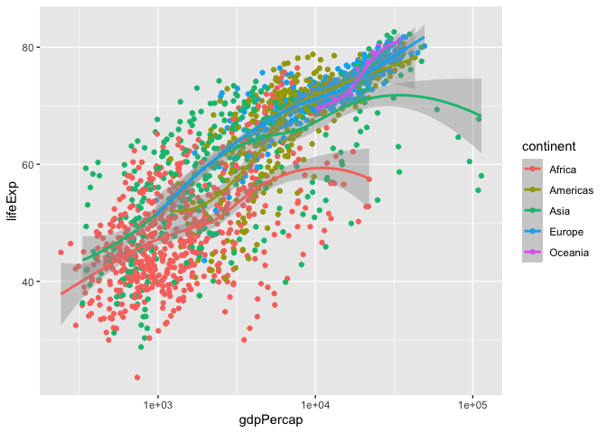
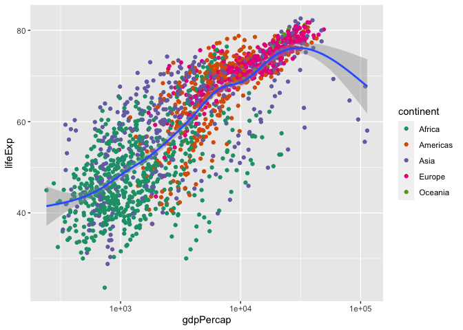

ggplot2 Overview & Demonstration
================

## Intro

Every graph can be described as a combination of independent building
blocks:

- **data**: a data frame: quantitative, categorical; local or database
  query
- **aes**thetic mapping of variable into visual properties: size, color,
  x, y
- **geom**etric objects: points, lines, areas, arrows, …
- **coord**inate system: Cartesian, log, polar, map

We’ll be working with the `gapminder` data again (but this time the
clean/filtered version). Let’s recreate one of the scatterplots we used
in our EDA demo.

``` r
library(tidyverse)
```

    ## ── Attaching core tidyverse packages ──────────────────────── tidyverse 2.0.0 ──
    ## ✔ dplyr     1.1.4     ✔ readr     2.1.4
    ## ✔ forcats   1.0.0     ✔ stringr   1.5.1
    ## ✔ ggplot2   3.4.4     ✔ tibble    3.2.1
    ## ✔ lubridate 1.9.3     ✔ tidyr     1.3.0
    ## ✔ purrr     1.0.2     
    ## ── Conflicts ────────────────────────────────────────── tidyverse_conflicts() ──
    ## ✖ dplyr::filter() masks stats::filter()
    ## ✖ dplyr::lag()    masks stats::lag()
    ## ℹ Use the conflicted package (<http://conflicted.r-lib.org/>) to force all conflicts to become errors

``` r
library(gapminder)
```

## Layering

ggplot2 builds plots in layers. The first layer is the data. Notice what
happens if you JUST call that one layer…you get a blank canvas.

``` r
ggplot(data = gapminder)
```

<!-- -->

The next layer is the aesthetic layer. Here is where you establish what
variables are mapped to the x and y axis. But notice that there’s still
no actual display of the data yet! We haven’t told it what shape to
display it in.

``` r
ggplot(data = gapminder, aes(x = gdpPercap, y = lifeExp))
```

<!-- -->

Then you add the geometric layer, telling ggplot what type of geometric
shape to plot.

``` r
ggplot(data = gapminder, aes(x = gdpPercap, y = lifeExp)) +
   geom_point()
```

<!-- -->

## Mappings

Now let’s really dig into it.

The following code makes these calls:

1.  data = gapminder: dataframe
2.  aes(x = gdpPercap, y = lifeExp): plot variables
3.  aes(color = continent): attributes
4.  geom_point(): what to plot

- the coordinate system is taken to be the standard Cartesian (x,y)

``` r
ggplot(data = gapminder, 
   aes(x = gdpPercap, y = lifeExp, 
       color = continent)) +
   geom_point()
```

<!-- -->

What happens if we change around some of the mappings? You get a graphic
that uses a grammar, but not in a way that makes any sense.

It’s like using words in a grammatically “correct” sentence, but it
makes no sense, like “colorless green data sleep furiously.”

``` r
ggplot(data = gapminder, 
   aes(x = continent, y = country, 
       color = gdpPercap)) +
   geom_bin2d()
```

    ## Warning: The following aesthetics were dropped during statistical transformation: colour
    ## ℹ This can happen when ggplot fails to infer the correct grouping structure in
    ##   the data.
    ## ℹ Did you forget to specify a `group` aesthetic or to convert a numerical
    ##   variable into a factor?

<!-- -->

## Statistics and Scales

Other ggplot2 building blocks:

- **stat**istical transformations: data summaries like mean, sd, binning
  & counting, …
- **scale**s: legends, axes to allow reading data from a plot

In the next code call,

1.  data = gapminder: dataframe
2.  aes(x = gdpPercap, y = lifeExp): plot variables
3.  aes(color = continent): attributes
4.  geom_point(): what to plot
5.  geom_smooth(): a statistical transformation fits the data to a loess
    smoother, and then returns predictions from evenly spaced points
    within the range of the data.
6.  scale_x_log10(): transforms the X axis into log scale.

- the coordinate system is taken to be the standard Cartesian (x,y)
- note that color is “inherited” by geom_smooth, so there are 5 trend
  lines.

``` r
ggplot(data = gapminder, 
   aes(x = gdpPercap, y = lifeExp, 
       color = continent)) +
   geom_point() +
   geom_smooth() +
   scale_x_log10()
```

    ## `geom_smooth()` using method = 'loess' and formula = 'y ~ x'

<!-- -->

*Note that you don’t have to be verbose in your code, ggplot2 makes good
assumptions based on where you put things in the code.*

## Inheritance

That last chart with a trend line for each continent was a bit too much.

- By moving the color specification to geom_point() it is NOT inherited
  further down the syntax.
- (You can also override inheritance by declaring an aesthetic mapping
  in the right geom.)

``` r
ggplot(gapminder, 
   aes(gdpPercap, lifeExp)) +
   geom_point(aes(color = continent)) +
   geom_smooth() +
   scale_x_log10()
```

    ## `geom_smooth()` using method = 'gam' and formula = 'y ~ s(x, bs = "cs")'

<!-- -->

## Other Mappings

Let’s see how we can change a few other things:

- Below, we’ve changed the mapping of the color aesthetic to `year`
- Mapped `continent` to shape
- Set the alpha level of the shape to 0.8; alpha tells us how
  transparent to make the mark and runs from 0 (completely transparent)
  to 1 (completely opaque).

This doesn’t build us a very helpful plot for interpretation, but
hopefully it helps YOU see how you can work with different aesthetic
mappings.

``` r
ggplot(data = gapminder, 
   aes(x = gdpPercap, y = lifeExp)) +
   geom_point(aes(color = year, shape = continent, size = pop), alpha = 0.8) +
   geom_smooth() +
   scale_x_log10()
```

    ## `geom_smooth()` using method = 'gam' and formula = 'y ~ s(x, bs = "cs")'

<!-- -->

## Working With Color

Before we move on to other ggplot2 building blocks, let’s go back to a
reasonable plot, and see what we can do with color.

First, know that you can manually change the colors with
`scale_color_manual`. You can specify 140 colors by name; or you can use
hex.

``` r
ggplot(data = gapminder, 
   aes(x = gdpPercap, y = lifeExp)) +
   geom_point(aes(color = continent)) +
   geom_smooth() +
   scale_x_log10() +
   scale_color_manual(values = c("red", "orange", "yellow", "green", "blue"))
```

    ## `geom_smooth()` using method = 'gam' and formula = 'y ~ s(x, bs = "cs")'

<!-- -->

You can (and probably should) use prebuilt color palettes.

``` r
p2 <- ggplot(data = gapminder, 
   aes(x = gdpPercap, y = lifeExp)) +
   geom_point(aes(color = continent)) +
   geom_smooth() +
   scale_x_log10() +
   scale_color_brewer(palette = "Dark2")

print(p2)
```

    ## `geom_smooth()` using method = 'gam' and formula = 'y ~ s(x, bs = "cs")'

<!-- -->

## More on Layers

Other ggplot2 building blocks:

- **layer**s: graph elements can be combined with “+”; graphs can be
  saved to a variable and then have layers added on to them iteratively.
- **theme**s: change graphic elements consistently

Below, we create a plot named `p1` which uses a **linear model**
statistical transformation for to display it’s `geom_smooth`. It makes
an aesthetic call to `color=continent` so there are separate linear
trend lines for each continent group.

We can then call `p1` and add another layer on top of it that is
*another* `geom_smooth`, but this one uses the loess method and has a
constant color attribute (instead of mapping any variable onto the color
aesthetic).

Note that this just as easily could have been done in one big ggplot
call with multiple layers, we are just doing it this way to show you how
you can name plots and recall them later to add layers.

``` r
p1 <- ggplot(data = gapminder, 
   aes(x = gdpPercap, y = lifeExp)) +
   geom_point(aes(color = continent)) +
   geom_smooth(method="lm", aes(color=continent))

p1 +
   geom_smooth(method="loess", color="black", se=FALSE) +
   scale_x_log10() 
```

    ## `geom_smooth()` using formula = 'y ~ x'
    ## `geom_smooth()` using formula = 'y ~ x'

<!-- -->

## Themes

Now let’s see what happens when we change a plots theme. ggplot2 comes
with a number of built-in themes that can be easily called. Note if you
haven’t saved a ggplot object, `last_plot()` gives you something to work
with.

``` r
last_plot() + theme_bw()
```

    ## `geom_smooth()` using formula = 'y ~ x'
    ## `geom_smooth()` using formula = 'y ~ x'

<!-- -->

``` r
last_plot() + theme_dark()
```

    ## `geom_smooth()` using formula = 'y ~ x'
    ## `geom_smooth()` using formula = 'y ~ x'

<!-- -->

You can obtain other people’s alternative themes through packages like
`ggthemes`

``` r
last_plot() + ggthemes::theme_economist()
```

    ## `geom_smooth()` using formula = 'y ~ x'
    ## `geom_smooth()` using formula = 'y ~ x'

<!-- -->

``` r
last_plot() + ggthemes::theme_fivethirtyeight()
```

    ## `geom_smooth()` using formula = 'y ~ x'
    ## `geom_smooth()` using formula = 'y ~ x'

<!-- -->

``` r
last_plot() + ggthemes::theme_wsj()
```

    ## `geom_smooth()` using formula = 'y ~ x'
    ## `geom_smooth()` using formula = 'y ~ x'

<!-- -->

``` r
last_plot() + ggthemes::theme_tufte()
```

    ## `geom_smooth()` using formula = 'y ~ x'
    ## `geom_smooth()` using formula = 'y ~ x'

<!-- -->

You can update a theme just by adding another `theme` call:

``` r
last_plot() + 
   theme(legend.position = "top")
```

    ## `geom_smooth()` using formula = 'y ~ x'
    ## `geom_smooth()` using formula = 'y ~ x'

<!-- -->

You can also create custom themes and then use them as needed:

``` r
rb_theme <- theme(plot.title = element_text(size=30, family = "DIN", face = "bold"),
                   legend.position = "top",
                   legend.text = element_text(family = "DIN"),
                   legend.title = element_blank(),
                   strip.text.x = element_text(size = 12, family = "DIN"),
                   plot.subtitle = element_text(face = "italic", family = "Gill Sans"),
                   plot.caption = element_text(face = "italic", family = "Gill Sans"),
                   axis.text = element_text(family = "DIN", face = "bold"),
                   axis.title = element_text(size = 12, family = "DIN"))

last_plot() + 
   rb_theme
```

    ## `geom_smooth()` using formula = 'y ~ x'
    ## `geom_smooth()` using formula = 'y ~ x'

<!-- -->

## Saving Plots

You’ll want to save your plots eventually.

- To save your most recent plot, just use `ggsave` with a path and
  filename

``` r
ggsave("plots/pop_top5_americas.png")
```

    ## Saving 7 x 5 in image
    ## `geom_smooth()` using formula = 'y ~ x'
    ## `geom_smooth()` using formula = 'y ~ x'

- If you have a plot object, name it as an argument to the `ggsave`
  function

``` r
ggsave("plots/test1.png", p2)
```

    ## Saving 7 x 5 in image
    ## `geom_smooth()` using method = 'gam' and formula = 'y ~ s(x, bs = "cs")'

- You can also specify the size it is saved in, indicating the height
  and width and the appropriate units ( options are “in”, “cm”, “mm”,
  “px”).

- You can also save it in a number of different formats (pdf, png, eps,
  svg, jpg, …)

``` r
ggsave("plots/test2.pdf", width = 8.5, height = 11, units = "in")
```

    ## `geom_smooth()` using method = 'gam' and formula = 'y ~ s(x, bs = "cs")'
