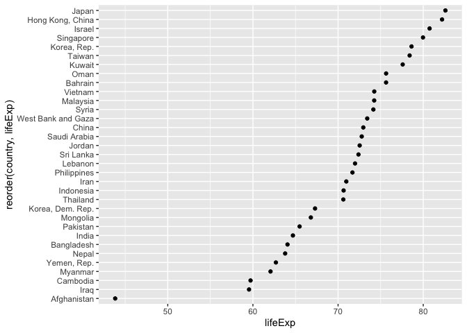
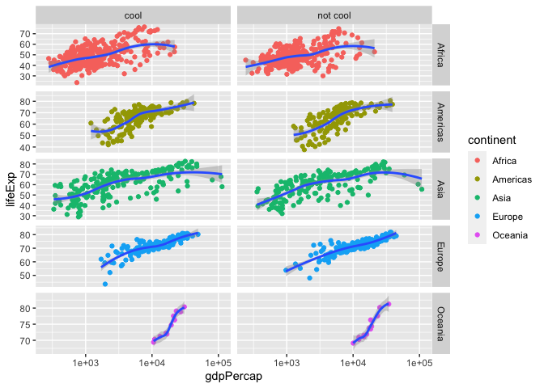
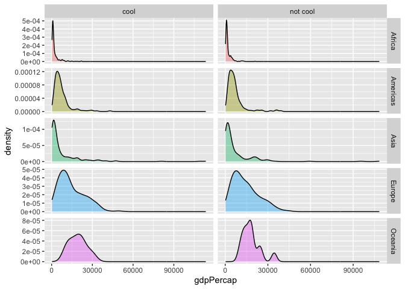

PPOL 6802 Week 7 - Bivariate Visualization
================
Alex Lundry
2024-02-22

## Intro and Setup

Today we’ll be learning how to create visualizations in R and ggplot2 of
bivariate data. For this demonstration we will be using the
[Gapminder](https://www.gapminder.org/) dataset. If you have not already
done so, please run `install.packages("gapminder")` so that you have the
access to the data on your computer and your R environment.

Once that is done, load the necessary libraries in R:

``` r
library(tidyverse)
```

    ## ── Attaching core tidyverse packages ──────────────────────── tidyverse 2.0.0 ──
    ## ✔ dplyr     1.1.4     ✔ readr     2.1.4
    ## ✔ forcats   1.0.0     ✔ stringr   1.5.1
    ## ✔ ggplot2   3.4.4     ✔ tibble    3.2.1
    ## ✔ lubridate 1.9.3     ✔ tidyr     1.3.0
    ## ✔ purrr     1.0.2     
    ## ── Conflicts ────────────────────────────────────────── tidyverse_conflicts() ──
    ## ✖ dplyr::filter() masks stats::filter()
    ## ✖ dplyr::lag()    masks stats::lag()
    ## ℹ Use the conflicted package (<http://conflicted.r-lib.org/>) to force all conflicts to become errors

``` r
library(scales)
```

    ## 
    ## Attaching package: 'scales'
    ## 
    ## The following object is masked from 'package:purrr':
    ## 
    ##     discard
    ## 
    ## The following object is masked from 'package:readr':
    ## 
    ##     col_factor

``` r
library(gapminder)
```

Let’s take a very quick look at the data in order to understand what we
have to work with:

``` r
glimpse(gapminder)
```

    ## Rows: 1,704
    ## Columns: 6
    ## $ country   <fct> "Afghanistan", "Afghanistan", "Afghanistan", "Afghanistan", …
    ## $ continent <fct> Asia, Asia, Asia, Asia, Asia, Asia, Asia, Asia, Asia, Asia, …
    ## $ year      <int> 1952, 1957, 1962, 1967, 1972, 1977, 1982, 1987, 1992, 1997, …
    ## $ lifeExp   <dbl> 28.801, 30.332, 31.997, 34.020, 36.088, 38.438, 39.854, 40.8…
    ## $ pop       <int> 8425333, 9240934, 10267083, 11537966, 13079460, 14880372, 12…
    ## $ gdpPercap <dbl> 779.4453, 820.8530, 853.1007, 836.1971, 739.9811, 786.1134, …

Looks like each row is an observation of a specific country in a
particular year, with three numeric measures: life expectancy,
population and the GDP per capita. We could, of course investigate each
of these individually using the univariate visualizations we covered two
weeks ago (bar charts, pie charts, histograms, density plots, and so
on). Let’s assume for now that we have sufficiently investigated each
variable in isolation, and it is now time to look at interactions
between them.

## Categorical & Numeric Variables

We’ll begin first with visualizing a categorical and numeric variable
together. We begin with this one because 1) in many ways it is the
simplest of our interactions, and 2) we’ve kind of already done these.
In fact, the construction of these visualizations will be minimally
different from how we built them for most of our univariate analysis,
BECAUSE we ended up doing our “counting” for most of our univariate
visualizations outside of ggplot. You’ll see what I mean shortly…

Before we begin, let’s get our data ready. For this demonstration, our
task is the following:

- *Show me the populations of the 10 most populous countries in the
  world in 2007.*

Take a minute, and try to write code to do that without looking ahead… .
. . . . . . . . . . We use our tidyverse syntax to take the gapminder
data, pipe it into a filter for the year 2007, sort it descending by
population and then take the first 10 rows.

``` r
d1 <- gapminder %>%
  filter(year == 2007) %>%
  arrange(desc(pop)) %>%
  slice(1:10)

d1
```

    ## # A tibble: 10 × 6
    ##    country       continent  year lifeExp        pop gdpPercap
    ##    <fct>         <fct>     <int>   <dbl>      <int>     <dbl>
    ##  1 China         Asia       2007    73.0 1318683096     4959.
    ##  2 India         Asia       2007    64.7 1110396331     2452.
    ##  3 United States Americas   2007    78.2  301139947    42952.
    ##  4 Indonesia     Asia       2007    70.6  223547000     3541.
    ##  5 Brazil        Americas   2007    72.4  190010647     9066.
    ##  6 Pakistan      Asia       2007    65.5  169270617     2606.
    ##  7 Bangladesh    Asia       2007    64.1  150448339     1391.
    ##  8 Nigeria       Africa     2007    46.9  135031164     2014.
    ##  9 Japan         Asia       2007    82.6  127467972    31656.
    ## 10 Mexico        Americas   2007    76.2  108700891    11978.

### Bar Charts

Now let’s get that data into a simple bar.

Remember your ggplot syntax! At a minimum, we need three things…WHAT
three things?

- data
- aesthetic(s)
- geom

The dataset will be `d1` and then the aesthetics are what you are
encoding the data as. So, in this one, we are encoding country as the X
aesthetic (I haven’t explicitly declared it here - remember that ggplot
is really good at understanding what aesthetics you mean). And we want a
bar chart so we need a `geom_bar` call.

Now, you may think that’s all you need, but that’s a mistake, because
look at what happens:

``` r
ggplot(d1, aes(country)) +
  geom_bar()
```

<!-- -->

That isn’t right!!! Remember that we aren’t visualizing just one
variable. We are actually showing how another variable (population)
varies by country. The visualization above only mapped one of those
variables. It took that variable - `country` - and then saw that we were
using `geom_bar` and applied the default stat (count) to the data. So it
simply counted, how many times do I see “United States”? Well I see it
once. How many times do I see Bangladesh? Once.

But remember from Week 5 that’s not what we need. We already have the
number we want to visualize, so the “stat” we assign to it is called
“identity.” And when we do this, it means we need to make assignments
for both the X *and* the Y axis:

``` r
ggplot(d1, aes(country, pop)) +
  geom_bar(stat = "identity") +
  theme(legend.position = "none")
```

<!-- -->

Ok, that’s a good start, but remember all the good stuff we learned in
week 5? Here’s what I want you to do:

- make this a horizontal bar plot
- create a new variable called `billions` and if the country has a
  population of one billion or more it will be true.
- color any countries that have one billion or more in population
  differently than other countries.
- improve the labeling of the chart, give it a title and appropriate
  axis labels
- label the bars with the population
- make the label human readable

Here’s what it should look like:

<!-- -->

There is one big problem with this - it is not ordered. Let’s say we did
want to sort it, you’d probably be tempted to us `fct_infreq()`, but
let’s see what happens:

``` r
d1 %>% 
  mutate(Billions = ifelse(pop > 1000000000, T, F)) %>%
  ggplot(aes(fct_infreq(country), pop)) +
  geom_bar(aes(fill = Billions), stat = "identity") +
  geom_text(aes(label = str_c(round(pop/1000000000, 1), "B")), hjust = 1.1, color = "white") +
  scale_fill_manual(values = c("black", "red")) +
  labs(title = "Top 10 Most Populous Countries, 2007",
       x = "",
       y  = "2007 Population") +
  scale_y_continuous(labels = label_number(scale_cut = cut_long_scale())) +
  coord_flip()
```

<!-- -->

It didn’t work! Why not? `fct_infreq` relies upon counting up individual
observations in a dataset. Because our data has already been counted,
there is only 1 of each country, so there is nothing to put in order.

We need to do something else. We need to `reorder()`, which is a VERY
helpful function when you are dealing with data that has already been
counted like this. You would use reorder when you already have the data
modified the way you want it and you simply need to sort. And no, using
`arrange()` won’t work here because it does not change the underlying
ordering of the variable’s values; it is only a temporary “cosmetic”
change:

``` r
d1 %>% 
  mutate(Billions = ifelse(pop > 1000000000, T, F)) %>%
  arrange(desc(pop)) %>% 
  ggplot(aes(country, pop)) +
  geom_bar(aes(fill = Billions), stat = "identity") +
  geom_text(aes(label = str_c(round(pop/1000000000, 1), "B")), hjust = 1.1, color = "white") +
  scale_fill_manual(values = c("black", "red")) +
  labs(title = "Top 10 Most Populous Countries, 2007",
       x = "",
       y  = "2007 Population") +
  scale_y_continuous(labels = label_number(scale_cut = cut_long_scale())) +
  coord_flip()
```

<!-- -->

Instead `reorder()` provides a change to the underlying order that
translates over to the chart.

When using `reorder()` think of the syntax this way:
`reorder(country, pop)` can be translated to “reorder the variable
country based on the value of the variable pop.” And if you want to sort
in the opposite order, simply put a negative sign in front of the
variable `reorder(country, -pop)`

``` r
d1 %>% 
  mutate(Billions = ifelse(pop > 1000000000, T, F)) %>%
  arrange(desc(pop)) %>% 
  ggplot(aes(reorder(country, pop), pop)) +
  geom_bar(aes(fill = Billions), stat = "identity") +
  geom_text(aes(label = str_c(round(pop/1000000000, 1), "B")), hjust = 1.1, color = "white") +
  scale_fill_manual(values = c("black", "red")) +
  labs(title = "Top 10 Most Populous Countries, 2007",
       x = "",
       y  = "2007 Population") +
  scale_y_continuous(labels = label_number(scale_cut = cut_long_scale())) +
  coord_flip()
```

<!-- -->

### Cleveland Dot Plots

There is an alternative to these bar charts that can be useful when you
have a large amount of data and you want to minimize the “data-ink” in
the plot. For this demo, let’s look at the life expectancy of countries
in Asia in 2007. Here it is as bars:

``` r
gapminder %>%
  filter(continent == "Asia" & 
           year == 2007) %>% 
  ggplot(aes(lifeExp, country)) +
  geom_bar(stat = "identity")
```

<!-- -->

Certainly this could remain as a bar chart (with improvements), but
changing it to a Cleveland dot plot will give us a lighter, less dense
version. Instead of having a full filled in bar, you place a dot at the
end by changing geom_bar to `geom_point()`:

``` r
gapminder %>%
  filter(continent == "Asia" & 
           year == 2007) %>% 
  ggplot(aes(lifeExp, country)) +
  geom_point()
```

<!-- -->

Lighter! But very hard to make comparisons when it isn’t sorted. So
let’s get that fixed. We can do that with a `reorder` call in the
aesthetic function, telling it to reorder country by the value of
lifeExp.

``` r
gapminder %>%
  filter(continent == "Asia" & 
           year == 2007) %>% 
  ggplot(aes(lifeExp, reorder(country, lifeExp))) +
  geom_point()
```

<!-- -->

Much better! Now this gives us a ranking of the countries by life
expectancy and we can see the stunning gap in life expectancy between
Japan and Afghanistan.

We could also - with just a few modifications, turn this into an
alternative to Cleveland Dot Plots, sometimes called a lollipop chart.
It is called that because we increase the size of the dot and we add a
line that runs from the baseline (0 in this case) up to the point of the
dot, creating something that resembles a lollipop.

The first step to doing this is to add a line segment connecting each
point to the y axis:

- `geom_segment` adds a line to the plot. We have to give it a number of
  aesthetic mappings to work: where it should start and end on the X
  axis, and where it should go on the Y. You’ll notice that `y` and
  `yend` are identical. It needs both to function properly.

``` r
gapminder %>%
  filter(continent == "Asia" & 
           year == 2007) %>% 
  ggplot(aes(lifeExp, reorder(country, lifeExp))) +
  geom_segment(aes(x = 40, 
               xend = lifeExp, 
               y = reorder(country, lifeExp), 
               yend = reorder(country, lifeExp)),
               color = "lightgrey") +
  geom_point(color="darkred", size = 2) +
  labs (x = "Life Expectancy (years)",
        y = "",
        title = "Life Expectancy by Country",
        subtitle = "Gapminder data for Asia - 2007")
```

<!-- -->

This only gets us halfway there though. You can see that we are
suffering from some figure/ground issues here where the line segment
gets mixed up with the background color and the gridlines. We can
continue to clean this up by removing unnecessary elements, like the
grey background panel and horizontal gridlines:

- `theme` allows us to first give it a specific minimal theme, and then
  we add two more specific customizations in which we tell it to remove
  the major and minor gridlines in the panel.

``` r
gapminder %>%
  filter(continent == "Asia" & 
           year == 2007) %>% 
  ggplot(aes(lifeExp, reorder(country, lifeExp))) +
  geom_segment(aes(x = 40, 
               xend = lifeExp, 
               y = reorder(country, lifeExp), 
               yend = reorder(country, lifeExp)),
               color = "lightgrey") +
  geom_point(color="darkred", size = 2) +
  labs (x = "Life Expectancy (years)",
        y = "",
        title = "Life Expectancy by Country",
        subtitle = "Gapminder data for Asia - 2007") +
  theme_minimal() +
  theme(panel.grid.major = element_blank(),
        panel.grid.minor = element_blank())
```

<!-- -->

This is much breezier than our original bar chart!

### Conditional Box Plots

Remember how to make boxplots? All you need to do in order to make them
conditional on a categorical variable is to assign that categorical
variable as the X aesthetic (assuming the numeric one is assigned as the
Y).

Here we look at the distribution of the GDP per capita of countries
within a particular region for the year 2007.

``` r
gapminder %>% 
  filter(year ==2007) %>% 
ggplot(aes(x = continent, y = gdpPercap)) +
   geom_boxplot()
```

<!-- -->

Note here that we are designating an x and y aesthetic, and explicitly
declaring it just for clarity here (just to remind you that we can!).

We can also do a little manipulation of this to make it slightly more
readable. We do this by using a reorder function in the x aesthetic
declaration, but this is slightly different from what we’ve seen before!
Here we are telling it to reorder continent by gdpPercap, based on a
median function (that’s what FUN = is getting us there; you can
conceivably put any sort of function there).

This gives us a plot that is sorted from the continent with the lowest
median GDP per capita (Africa) to the continent with the highest
(Oceania).

``` r
gapminder %>% 
  filter(year ==2007) %>% 
  ggplot(aes(x = reorder(continent, gdpPercap, FUN = median), y = gdpPercap)) +
   geom_boxplot()
```

<!-- -->

Let’s improve this some more:

- Flipping this might also help (We could also have simply reversed the
  X and Y declarations, but this is easier (imho)).  
- Let’s color by continent. Yes, we already have it as one of the axis
  mappings, but it can’t hurt to have it doubly encoded here. To do
  this, we add an aesthetic call within `geom_boxplot` telling it to map
  the fill attribute to the country value.
- But let’s remove any legend that it creates - that is too much
  redundancy. We do this by calling `theme` and specifiying that legend
  position should be “none.” - And let’s add some labeling to the plot:
  title, subtitle, X and Y axis labels.
- Finally, I’d like to pretty up that axis labeling by calling the
  appropriate scales function. To do this, we must add a call to change
  the Y axis scale, so we use `scale_y_continuous` and we tell it to
  adjust the labels, using a function from the `scales` package called
  `label_dollar`. If you recall from our previous lesson, we use the
  `label_` functions when we are changing scale labels.

``` r
gapminder %>% 
  filter(year ==2007) %>% 
  ggplot(aes(x = reorder(continent, gdpPercap, FUN = median), y = gdpPercap)) +
  geom_boxplot(aes(fill = continent)) +
  labs(title = "Distribution of Country's GDP per Capita by Continent",
       subtitle = "Gapminder 2007 data",
       x = "Continent",
       y = "GDP per Capita") +
  scale_y_continuous(labels = label_dollar()) +
  coord_flip() +
  theme(legend.position = "none")
```

<!-- -->

This looks great! Notice that we remove the legend using a call to
`theme` and designate the parameter `legend.position` to “none”.

### Grouped Kernel Density Plots

As you may recall from week 5, the kernel density plot is basically just
a smoothed histogram. When we want to display the distribution of a
numeric variable for a number of categorical variables, showing
histograms can get a bit chaotic and overwhelming. In these instances
the density plots can be more useful.

As before with the boxplots, all we need to do is change the geom and
add a new aesthetic call mapping `fill` to our categorical variable:

``` r
ggplot(gapminder, aes(x = gdpPercap, fill = continent)) +
   geom_density()
```

<!-- -->

Ok, but that’s not great because they are overlapping each other.
Fortunately there is something we can change here: a fixed designation
in `geom_density` that sets the alpha - or transparency - to 0.4. The
alpha can range from 0 (completely transparent) to 1 (completely
opaque). We want it to be somewhat transparent because we are
overlapping them all on the same axis. This allows for a more direct
comparison.

``` r
ggplot(gapminder, aes(x = gdpPercap, fill = continent)) +
   geom_density(alpha = 0.4)
```

<!-- -->

The graph makes clear that, in general, there are a large number of
countries with low GDP on the African continent. Of course, we can clean
this up in a number of ways, labels, coloring, legend, scale formatting,
but you should get the picture by now. Instead, let’s visualize this
same data using a SLIGHTLY different visualization.

### Joyplots / Ridgelines

A ridgeline plot (also called a joyplot because it was used on the cover
of a famous Joy Division album) is multiple kernel density plots, but
spread out instead of having them overlap. This is a hint of a powerful
visualization technique we’ll learn shortly called “faceting.” Ridgeline
plots provide a separate plot for each categorical value, but makes them
more compact, allowing for some overlap.

You create these with the `ggridges` package with `geom_density_ridges`
and `theme_ridges` handling most of your use cases. Notice that since it
is highly likely that the distributions will overlap, you’ll want to set
the alpha in `geom_density_ridges` to some value less than 1.

``` r
# install.packages("ggridges")
library(ggridges)

ggplot(gapminder, aes(x = gdpPercap, y = continent, fill = continent)) +
  geom_density_ridges(alpha = 0.4) +
  theme_ridges() +
  theme(legend.position = "none") # legend is redundant since we already have continent on Y
```

    ## Picking joint bandwidth of 1650

<!-- -->

## Two Categorical Variables

Let’s shift now to visualizing two categorical variables. In these
instances we are going to be relying on variations of the bar chart.
(And note here that technically we are actually visualizing how a
numeric variable varies based on two categorical variables.)

### Stacked Bar Chart

In making bar charts of two categorical variables, we will be relying on
ggplot’s notion of “position.”

For these visualizations, we’ll be looking at the top 5 countries by
population in each continent in 2007, so let’s get our data ready. We
filter to our desired year, then group by continent, sort, and then
slice the top 5 countries in each continent (though the `slice()`
function specifies the top 5, it inherits the grouping from the
`group_by` so it gives the top 5 within each group):

``` r
g1 <- gapminder %>% 
   filter(year == 2007) %>% 
   group_by(continent) %>% 
   arrange(desc(pop)) %>% 
   slice(1:5) 

g1
```

    ## # A tibble: 22 × 6
    ## # Groups:   continent [5]
    ##    country          continent  year lifeExp       pop gdpPercap
    ##    <fct>            <fct>     <int>   <dbl>     <int>     <dbl>
    ##  1 Nigeria          Africa     2007    46.9 135031164     2014.
    ##  2 Egypt            Africa     2007    71.3  80264543     5581.
    ##  3 Ethiopia         Africa     2007    52.9  76511887      691.
    ##  4 Congo, Dem. Rep. Africa     2007    46.5  64606759      278.
    ##  5 South Africa     Africa     2007    49.3  43997828     9270.
    ##  6 United States    Americas   2007    78.2 301139947    42952.
    ##  7 Brazil           Americas   2007    72.4 190010647     9066.
    ##  8 Mexico           Americas   2007    76.2 108700891    11978.
    ##  9 Colombia         Americas   2007    72.9  44227550     7007.
    ## 10 Argentina        Americas   2007    75.3  40301927    12779.
    ## # ℹ 12 more rows

First, let’s see what happens if we call `geom_bar` here:

``` r
g1 %>% 
  ggplot(aes(continent, pop)) +
  geom_bar(stat = "identity") 
```

<!-- -->

You see the tiny lines? We only gave it continent and population as
aesthetic mappings, so `geom_bar` is taking the rows that represent each
individual country and automatically stacking those bars on top of one
another. Those are each continent’s bars dividing into their respective
countries. This will be easier to see if we map fill to country:

``` r
g1 %>% 
  ggplot(aes(continent, pop)) +
  geom_bar(stat = "identity", aes(fill = country)) +
  theme(legend.position = "none")
```

<!-- -->

This default behavior, when it has multiple rows to display, is
`position = "stack"`. There may be some very legitimate use cases for
this type of bar chart. For example we may want to see total population
by continent, while having some sense of how many countries make up each
continent. Or remember that songwriting stacked bar chart which showed
the composition of top 5 hit writing times over time?

### Grouped Bar Chart

But this may not be exactly the right way to visualize this data,
especially if we want some comparison of how individual countries within
a continent compare to one another. In this case, we can use
`position = "dodge"` to turn this into a grouped bar chart. Everything
else in the syntax is the same, except for our override of the default
position in the geom_bar call. Again, not a great chart, but this should
serve for demonstration purposes when it comes to “position.”

``` r
g1 %>% 
   ggplot(aes(continent, pop)) +
   geom_bar(stat = "identity", aes(fill = country), position = "dodge") +
   theme(legend.position = "none")
```

<!-- -->

### 100% Stacked Bar Chart

Finally, perhaps we are less interested in absolute numbers and instead
interested in how the countries proportionally contribute to each
continent. So here we use `position = "fill"` to turn this into a 100%
stacked bar chart. It’s not a great chart, for it can be massively
improved, but hopefully you get the point.

``` r
g1 %>% 
   ggplot(aes(continent, pop)) +
   geom_bar(stat = "identity", aes(fill = country), position = "fill") +
   theme(legend.position = "none")
```

<!-- -->

## Two Numeric Variables

When we are looking to visualize the relationship between two numeric
variables you’ll end up using a scatterplot, one of our most information
dense visualizations.

### Scatterplot

We’ve actually already created a few scatterplots during our
introductory lesson on ggplot! Let’s bring those back up and briefly
review how to make them…

We’ll look at the the relationship between GDP and life expectancy. We
declare these as our aesthetics and then the geom mapping we use is
`geom_point`.

``` r
ggplot(gapminder, aes(gdpPercap, lifeExp)) +
   geom_point()
```

<!-- -->

This is pretty interesting! It appears as though higher GDP is
associated with higher life expectancy, but only to a point. Let’s put a
trend line through it to see what the model tells us.

We can do this with a simple addition of a smooth geom - remember this
is an instance of adding another stat to the visualization.
`geom_smooth()` is a statistical transformation that fits the data to a
loess smoother, and then returns predictions from evenly spaced points
within the range of the data.

``` r
ggplot(gapminder, aes(gdpPercap, lifeExp)) +
   geom_point() +
   geom_smooth()
```

    ## `geom_smooth()` using method = 'gam' and formula = 'y ~ s(x, bs = "cs")'

<!-- -->

This sort of shape - where there is an obvious and single curve to the
data - makes me think that log-transforming the data might make sense.
This can be done by adding a scale_x statement; in this case
`scale_x_log10`, which transforms the X axis into log scale.

``` r
ggplot(gapminder, aes(gdpPercap, lifeExp)) +
   geom_point() +
   scale_x_log10() +
   geom_smooth()
```

    ## `geom_smooth()` using method = 'gam' and formula = 'y ~ s(x, bs = "cs")'

<!-- -->

This gives us a nice linear relationship. As always, there is a lot of
cleanup that can be done to make this look nice, but this will do for
the purposes of this demonstration.

## Many Variables

Now things are going to get really interesting! Let’s see what options
we have available to us for multiple variables.

Firstly, when we want to investigate the intersection of many variables,
we should remember that we can easily add additional aesthetics to many
of the plots we’ve already created.

You can make aesthetic mappings to:

- color
- shape
- size
- alpha

In particular, color can be an extremely useful addition to our plots to
help layer in an additional variable. For example, we can add color
mapped to continent to our previous scatterplot, giving us some more
insight into how the relationship between GDP per capita and life
expectancy vary by continent:

``` r
ggplot(gapminder, aes(gdpPercap, lifeExp, color = continent)) +
   geom_point() +
   scale_x_log10() +
   geom_smooth()
```

    ## `geom_smooth()` using method = 'loess' and formula = 'y ~ x'

<!-- -->

Remember that because we put fill in the original ggplot call it is
inherited by the `geom_smooth` call! If we had not put it there, then we
would have only one smoothed line.

You could even add another variable to the same plot by adding an
aesthetic mapping to something like size:

``` r
ggplot(gapminder, aes(gdpPercap, lifeExp, color = continent)) +
   geom_point(aes(size = pop)) +
   scale_x_log10() +
   geom_smooth()
```

    ## `geom_smooth()` using method = 'loess' and formula = 'y ~ x'

<!-- -->

Here it is changing our size mapping to an alpha mapping, which arguably
works a little better:

``` r
ggplot(gapminder, aes(gdpPercap, lifeExp, color = continent)) +
   geom_point(aes(alpha = pop)) +
   scale_x_log10() +
   geom_smooth()
```

    ## `geom_smooth()` using method = 'loess' and formula = 'y ~ x'

<!-- -->

Why not do both?

``` r
ggplot(gapminder, aes(gdpPercap, lifeExp, color = continent)) +
   geom_point(aes(size = pop, alpha = pop)) +
   scale_x_log10() +
   geom_smooth()
```

    ## `geom_smooth()` using method = 'loess' and formula = 'y ~ x'

<!-- -->

These aren’t fantastic charts, but they are a great starting point.
Instead, the overall point here is that once you know ggplot well enough
it becomes quite easy to start adding variables to a plot. However, you
need to keep in mind our lessons about pre-attentive processing and how
easily different encodings are discernible by viewers!

### Faceting

Now we arrive at an extremely powerful visual analytical tool when
working with many variables: faceting. We saw a hint of it’s power when
we looked at ridgeline plots (joy plots) earlier.

Faceting breaks a plot into subsets and display small multiples
conditional on another variable.

Let’s take our scatterplot of GDP per capita by life expectancy and
think about how other variables come into play here. We will keep
continent mapped to color, but let’s also assign it to a facet. Let’s
take a detailed look at the call below:

1.  `data = gapminder`: dataframe
2.  `aes(x = gdpPercap, y = lifeExp)`: plot variables
3.  `geom_point()`: what to plot, with a aes(color = continent)
    attribute
4.  `geom_smooth()`: a statistical transformation fits the data to a
    loess smoother, and then returns predictions from evenly spaced
    points within the range of the data.
5.  `scale_x_log10()`: transforms the X axis into log scale.
6.  `facet_wrap`: breaks the plot into subsets and display small
    multiples conditional on the continent variable.

- note that each plot separately uses all of the calls , so there are
  separate geom_smooth lines for each subsetted plot

``` r
ggplot(gapminder, 
   aes(gdpPercap, lifeExp)) +
   geom_point(aes(color = continent)) +
   geom_smooth() +
   scale_x_log10() +
   facet_wrap(~ continent)
```

    ## `geom_smooth()` using method = 'loess' and formula = 'y ~ x'

<!-- -->

Look at how elegant and useful that is!! Faceting (aka small multiples)
is EXTREMELY useful and generally very easy for audiences to understand.

One thing you can do to make the facets (potentially) more interesting
is to let the x and/or y axes vary within each plot. You do that by
passing it a `scales` argument of one of the following:

- scales = “fixed”: x and y scales are identical (fixed) across all
  panels
- scales = “free_x”: the x scale is free, and the y scale is fixed
- scales = “free_y”: the y scale is free, and the x scale is fixed
- scales = “free”: x and y scales can vary across panels.

Let’s see how it looks with scales = free:

``` r
ggplot(gapminder, 
   aes(gdpPercap, lifeExp)) +
   geom_point(aes(color = continent)) +
   geom_smooth() +
   scale_x_log10() +
   facet_wrap(~ continent, scales = "free")
```

    ## `geom_smooth()` using method = 'loess' and formula = 'y ~ x'

<!-- -->

Notice the difference for Oceania in particular!

The `facet_wrap` call (predictably) wraps the facets. But you can force
all of your items into either a row or column by using `facet_grid` with
a specific type of variable call.

The `facet_grid` statement is written as a formula (that’s what the ~
means in R); it’s format is `Row ~ Column`, so the first variable you
give it will be used as the rows of your facet and the second will be
the columns.

If you want one variable to display just in a single row you would write
it as `facet_grid(. ~ VAR)` because your variable of interest would be
displayed in separate columns along a single row.

If you wanted them all in a single column it would be
`facet_grid(VAR ~ .)` because the variable values would be displayed in
separate rows, forcing the display into a single column.

Take a look at it in action. Here they are in a single row:

``` r
ggplot(gapminder, 
   aes(gdpPercap, lifeExp)) +
   geom_point(aes(color = continent)) +
   geom_smooth() +
   scale_x_log10() +
   facet_grid(. ~ continent, scales = "free") # display in single row
```

    ## `geom_smooth()` using method = 'loess' and formula = 'y ~ x'

<!-- -->

And here they are in a single column:

``` r
ggplot(gapminder, 
   aes(gdpPercap, lifeExp)) +
   geom_point(aes(color = continent)) +
   geom_smooth() +
   scale_x_log10() +
   facet_grid(continent ~ ., scales = "free") # display in single column
```

    ## `geom_smooth()` using method = 'loess' and formula = 'y ~ x'

<!-- -->

The version you use will vary depending upon what you want your viewer
to see!

Now, this should also give a hint to another powerful use for
facet_grid - adding yet another variable to the visualization!

You can also use `facet_grid` with two discrete variables to add yet
another layer to your graphic. Since we don’t have another
low-dimensional categorical variable in the dataset, we’ll make one up
to show how `facet_grid` would work:

``` r
d2 <- gapminder %>% 
   group_by(country) %>% 
   mutate(rand = sample(0:1, n(), replace = TRUE), 
          cool = ifelse(rand == 0, "not cool", "cool"))

ggplot(d2, 
   aes(gdpPercap, lifeExp)) +
   geom_point(aes(color = continent)) +
   geom_smooth() +
   scale_x_log10() +
   facet_grid(continent ~ cool, scales = "free_y")
```

    ## `geom_smooth()` using method = 'loess' and formula = 'y ~ x'

<!-- -->

Look at all that data!

It doesn’t have to be a scatterplot that gets faceted. Check it out here
where we use it on the density plot we created earlier.

``` r
ggplot(d2, aes(x = gdpPercap, fill = continent)) +
   geom_density(alpha = 0.4) +
  facet_grid(continent ~ cool, scales = "free") +
  theme(legend.position = "none")
```

<!-- -->

## Time Dependent Graphs

Another very common type of multivariate plot is the visualization of
time against other key variables, allowing us to see how measures ebb
and flow over the years, months, days, minutes and seconds. Here we’ll
look at a few different ways of visualizing time, many of which are
simply variations of other charts we’ve already seen.

### Time Series

The simplest visualization of time is a line plot in which time is
displayed on the X axis running from left to right (at least in Western
cultures). To do so, we call `geom_line` with x assigned to our time
variable and y to whatever numeric variable we’d like to show. Let’s
look at how life expectancy has changed over the years in the United
States:

``` r
gapminder %>% 
  filter(country == "United States") %>% 
  ggplot(aes(year, lifeExp)) +
  geom_line() 
```

<!-- -->

Easy enough, but it is hard to read individual values in the graph
above. When there are so few individual values, you may want to make
some visual adjustments to make them easier to identify.

To do so, we’ll add points to the chart with an additional layer that
calls `geom_point`. It will inherit the key aesthetics from the initial
call, but we’ll give it some fixed attributes on size and color. And
we’ll make some similar adjustments within `geom_line`. Finally we’ll
add some labeling to the plot and to the points. For the latter, we add
a `geom_text` layer, giving it a `label` aesthetic mapping, doing some
rounding to the number and then setting the label to the right of the
point with an `hjust`.

``` r
gapminder %>% 
  filter(country == "United States") %>% 
  ggplot(aes(year, lifeExp)) +
  geom_line(size = 1.5, 
            color = "lightgrey") +
  geom_point(size = 3, 
             color = "steelblue") +
  geom_text(aes(label = round(lifeExp, 1)), hjust = -0.3) +
  labs(y = "Life Expectancy (years)", 
       x = "Year",
       title = "Life expectancy changes over time",
       subtitle = "United States (1952-2007)",
       caption = "Source: http://www.gapminder.org/data/")
```

    ## Warning: Using `size` aesthetic for lines was deprecated in ggplot2 3.4.0.
    ## ℹ Please use `linewidth` instead.
    ## This warning is displayed once every 8 hours.
    ## Call `lifecycle::last_lifecycle_warnings()` to see where this warning was
    ## generated.

<!-- -->

That was an instance of just a few data points. Let’s look at a plot
with many. The `economics` dataset comes with ggplot and it contains US
monthly economic data collected from January 1967 thru January 2015.
Let’s plot the personal savings rate (psavert) over time using our
simple line plot.

``` r
ggplot(economics, aes(date, psavert)) +
  geom_line() +
  labs(title = "Personal Savings Rate",
       x = "Date",
       y = "Personal Savings Rate")
```

<!-- -->

The scale_x_date function can be used to reformat dates and change the
tick marks. Below we pass it parameters so that ticks appear every 5
years and dates are presented in MMM-YY format. (To see all the various
options for date formatting, use `help(strptime)`). We make a few other
tweaks, giving the line some color and setting the size, adding a loess
smoother, putting labels on the plot and simplifying the theme.

``` r
ggplot(economics, aes(x = date, y = psavert)) +
  geom_line(color = "indianred3", 
            size= 1) +
  geom_smooth() +
  scale_x_date(date_breaks = '5 years', 
               labels = label_date("%b-%y")) +
  labs(title = "Personal Savings Rate",
       subtitle = "1967 to 2015",
       x = "",
       y = "Personal Savings Rate") +
  theme_minimal()
```

    ## `geom_smooth()` using method = 'loess' and formula = 'y ~ x'

<!-- -->

This can just as easily be turned into an area chart, by changing to a
`geom_area`.

``` r
ggplot(economics, aes(date, psavert)) +
  geom_area() +
  labs(title = "Personal Savings Rate",
       x = "Date",
       y = "Personal Savings Rate")
```

<!-- -->

If we wanted to get a little fancy, we can change the fixed values of
the area’s fill and line color:

``` r
ggplot(economics, aes(date, psavert)) +
  geom_area(fill="lightblue", color="yellow") +
  labs(title = "Personal Savings Rate",
       x = "Date",
       y = "Personal Savings Rate")
```

<!-- -->

Finally, there will be times when you’ll need to display multiple time
series on the same chart. A good example of this is when you are
comparing stock prices. Let’s compare closing prices for Apple and
Netflix from 2013 through today. The `tq_get` function in the
`tidyquant` package is used to obtain the stock data from Yahoo Finance.
(You’ll have to install `tidyquant` first).

The key thing here when displaying multiple time series is to 1) **make
sure the data is TALL and not WIDE**, and 2) to map the color aesthetic
to the categorical variable that differentiates between the multiple
series, in this case `symbol`. Take a look at the data so you understand
this:

``` r
# install.packages("tidyquant")
library(tidyquant)
```

    ## Loading required package: PerformanceAnalytics

    ## Loading required package: xts

    ## Loading required package: zoo

    ## 
    ## Attaching package: 'zoo'

    ## The following objects are masked from 'package:base':
    ## 
    ##     as.Date, as.Date.numeric

    ## 
    ## ######################### Warning from 'xts' package ##########################
    ## #                                                                             #
    ## # The dplyr lag() function breaks how base R's lag() function is supposed to  #
    ## # work, which breaks lag(my_xts). Calls to lag(my_xts) that you type or       #
    ## # source() into this session won't work correctly.                            #
    ## #                                                                             #
    ## # Use stats::lag() to make sure you're not using dplyr::lag(), or you can add #
    ## # conflictRules('dplyr', exclude = 'lag') to your .Rprofile to stop           #
    ## # dplyr from breaking base R's lag() function.                                #
    ## #                                                                             #
    ## # Code in packages is not affected. It's protected by R's namespace mechanism #
    ## # Set `options(xts.warn_dplyr_breaks_lag = FALSE)` to suppress this warning.  #
    ## #                                                                             #
    ## ###############################################################################

    ## 
    ## Attaching package: 'xts'

    ## The following objects are masked from 'package:dplyr':
    ## 
    ##     first, last

    ## 
    ## Attaching package: 'PerformanceAnalytics'

    ## The following object is masked from 'package:graphics':
    ## 
    ##     legend

    ## Loading required package: quantmod

    ## Loading required package: TTR

    ## Registered S3 method overwritten by 'quantmod':
    ##   method            from
    ##   as.zoo.data.frame zoo

``` r
stocks <- tq_get(c("AAPL", "NFLX"), get = "stock.prices")

stocks
```

    ## # A tibble: 5,102 × 8
    ##    symbol date        open  high   low close    volume adjusted
    ##    <chr>  <date>     <dbl> <dbl> <dbl> <dbl>     <dbl>    <dbl>
    ##  1 AAPL   2014-01-02  19.8  19.9  19.7  19.8 234684800     17.3
    ##  2 AAPL   2014-01-03  19.7  19.8  19.3  19.3 392467600     16.9
    ##  3 AAPL   2014-01-06  19.2  19.5  19.1  19.4 412610800     17.0
    ##  4 AAPL   2014-01-07  19.4  19.5  19.2  19.3 317209200     16.9
    ##  5 AAPL   2014-01-08  19.2  19.5  19.2  19.4 258529600     17.0
    ##  6 AAPL   2014-01-09  19.5  19.5  19.1  19.2 279148800     16.8
    ##  7 AAPL   2014-01-10  19.3  19.3  19.0  19.0 304976000     16.7
    ##  8 AAPL   2014-01-13  18.9  19.4  18.9  19.1 378492800     16.8
    ##  9 AAPL   2014-01-14  19.2  19.5  19.2  19.5 332561600     17.1
    ## 10 AAPL   2014-01-15  19.8  20.0  19.7  19.9 391638800     17.4
    ## # ℹ 5,092 more rows

It is much easier to put multiple lines on a plot when the data is long
and you have a variable that can easily be used to distinguish the lines
(in this case `symbol`). I’ll show you in a moment why it’s trickier
with “wide” data.

But before that, let’s look at our viz. You’ll notice that I also added
some modifications to the axes through `scale_x_date` and
`scale_y_continuous`, as well as labeling, a minimal theme and setting
the colors using a pre-built palette.

``` r
ggplot(stocks, aes(date, close, color=symbol)) + 
  geom_line(size=1) +
  scale_x_date(date_breaks = '1 year', 
               labels = label_date("%Y")) +
  scale_y_continuous(labels = label_dollar()) +
  labs(title = "NASDAQ Closing Prices",
       subtitle = "2013 - 2023",
       caption = "source: Yahoo Finance",
       x = "Year",
       y = "Closing Price") +
  theme_minimal() +
  scale_color_brewer(palette = "Dark2")
```

<!-- -->

Now, let’s consider what we would have to do if this data were “wide.”
To show you that, I’ll change the data using a handy tidyverse function
called `pivot_wider`. There’s also a corresponding `pivot_longer`. I
won’t go into the details of how to use these, but you should play
around with it, as it can be extremely useful. But for now, take a look
at how it changes the data:

``` r
wide_stocks <- stocks %>% 
  select(symbol, date, close) %>% 
  pivot_wider(values_from = close, names_from = symbol)

wide_stocks
```

    ## # A tibble: 2,551 × 3
    ##    date        AAPL  NFLX
    ##    <date>     <dbl> <dbl>
    ##  1 2014-01-02  19.8  51.8
    ##  2 2014-01-03  19.3  51.9
    ##  3 2014-01-06  19.4  51.4
    ##  4 2014-01-07  19.3  48.5
    ##  5 2014-01-08  19.4  48.7
    ##  6 2014-01-09  19.2  48.2
    ##  7 2014-01-10  19.0  47.4
    ##  8 2014-01-13  19.1  48.1
    ##  9 2014-01-14  19.5  48.3
    ## 10 2014-01-15  19.9  47.2
    ## # ℹ 2,541 more rows

You will frequently receive data that looks like this. It’s not
impossible to visualize, but it would mean you have two separate
geom_line calls with two separate aesthetic mappings. This is harder to
“read” and can be more confusing for collaboraters or “future you.”

``` r
ggplot(wide_stocks, aes(x = date)) + 
  geom_line(aes(y = AAPL), size=1, color = "black") +
  geom_line(aes(y = NFLX), size = 1, color = "red") +
  scale_x_date(date_breaks = '1 year', 
               labels = label_date("%Y")) +
  scale_y_continuous(labels = label_dollar()) +
  labs(title = "NASDAQ Closing Prices",
       subtitle = "2013 - 2023",
       caption = "source: Yahoo Finance",
       x = "Year",
       y = "Closing Price") +
  theme_minimal() 
```

<!-- -->

### Dumbbell charts

Dumbbell charts are useful for displaying change between two (AND ONLY
TWO!) time points for several groups or observations. You end up with a
visualization that looks like a dumbbell with two points representing
the values at two different times, connected by a line segment. The
`geom_dumbbell` function comes from the `ggalt` package.

Using the gapminder dataset let’s plot the change in life expectancy
from 1952 to 2007 in the Americas. Unlike what we just talked about
above, and somewhat frustratingly, to visualize the `geom_dumbbell` you
need the data to be in a WIDE format, instead of the tall format it is
currently in.

So let’s use that `pivot_wider` function yet again! Here we are telling
it to turn the data into a wider table and to use the `years` variable
to make new columns with a specific prefix, and populate those new
columns with the values from the `lifeExp` variable. And notice that we
have to select down the dataset variables to only those that are
absolutely necessary for the pivoted data.

``` r
gapminder2 <- gapminder %>% 
  filter(continent == "Americas" &
           year %in% c(1952, 2007)) %>%
  select(country, year, lifeExp) %>% 
  pivot_wider(names_from = year, 
              values_from = lifeExp, names_prefix = "year_")

gapminder2
```

    ## # A tibble: 25 × 3
    ##    country            year_1952 year_2007
    ##    <fct>                  <dbl>     <dbl>
    ##  1 Argentina               62.5      75.3
    ##  2 Bolivia                 40.4      65.6
    ##  3 Brazil                  50.9      72.4
    ##  4 Canada                  68.8      80.7
    ##  5 Chile                   54.7      78.6
    ##  6 Colombia                50.6      72.9
    ##  7 Costa Rica              57.2      78.8
    ##  8 Cuba                    59.4      78.3
    ##  9 Dominican Republic      45.9      72.2
    ## 10 Ecuador                 48.4      75.0
    ## # ℹ 15 more rows

Now let’s visualize it. We call the specialized `geom_dumbbell` and we
have to be sure we have given it an X and Y variable, but also an `xend`
which will have the second datapoint.

``` r
# install.packages("ggalt")
library(ggalt)
```

    ## Registered S3 methods overwritten by 'ggalt':
    ##   method                  from   
    ##   grid.draw.absoluteGrob  ggplot2
    ##   grobHeight.absoluteGrob ggplot2
    ##   grobWidth.absoluteGrob  ggplot2
    ##   grobX.absoluteGrob      ggplot2
    ##   grobY.absoluteGrob      ggplot2

``` r
ggplot(gapminder2, aes(y = country, 
                       x = year_1952, xend = year_2007)) +  
  geom_dumbbell()
```

    ## Warning: Using the `size` aesthetic with geom_segment was deprecated in ggplot2 3.4.0.
    ## ℹ Please use the `linewidth` aesthetic instead.
    ## This warning is displayed once every 8 hours.
    ## Call `lifecycle::last_lifecycle_warnings()` to see where this warning was
    ## generated.

<!-- -->

The graph will be easier to read if the countries are sorted (using
reorder) and the points are sized and colored. In the next graph, we’ll
sort by 2007 life expectancy, and modify the line and point size, color
the points, add titles and labels, and simplify the theme. Notice that
we are doing these as fixed parameters in the geom_dumbbell call.

``` r
gapminder2 %>% 
  ggplot(aes(y = reorder(country, year_2007), 
             x = year_1952, xend = year_2007)) +  
  geom_dumbbell(size = 1.2,
                size_x = 3, 
                size_xend = 3,
                colour = "grey", # yes, you must use the british spelling
                colour_x = "lightgreen", 
                colour_xend = "darkgreen") +
  theme_minimal() + 
  labs(title = "Change in Life Expectancy",
       subtitle = "1952 to 2007",
       x = "Life Expectancy (years)",
       y = "")
```

<!-- -->

### Slope graphs

Slope graphs are an alternative to dumbbell charts and can be
particularly useful when you have several time points, but not enough
consistency for a typical line chart. To demonstrate, we’ll plot life
expectancy for six Central American countries in 1992, 1997, 2002, and
2007 from the gapminder data. There are ways to do this on your own
using typical ggplot calls, but there is a useful function that makes
things easier: the `newggslopegraph` function from the `CGPfunctions`
package.

In this case there is no distinct geom to add to a typical ggplot call,
instead you simply call the function with four parameters:

1)  data frame
2)  time variable (which must be a factor, which is an ordered
    categorical variable)
3)  numeric variable to be plotted
4)  grouping variable (creating one line per group).

It then has sensible defaults that it applies. There are many changes
you can make to things like line thickness - check the help page for
details.

``` r
# install.packages("CGPfunctions")
library(CGPfunctions)
```

    ## Warning in .recacheSubclasses(def@className, def, env): undefined subclass
    ## "ndiMatrix" of class "replValueSp"; definition not updated

``` r
gapminder %>%
  filter(year %in% c(1992, 1997, 2002, 2007) &
           country %in% c("Panama", "Costa Rica", 
                          "Nicaragua", "Honduras", 
                          "El Salvador", "Guatemala",
                          "Belize")) %>%
  mutate(year = factor(year),
         lifeExp = round(lifeExp)) %>% 
  newggslopegraph(year, lifeExp, country) +
  labs(title="Life Expectancy by Country", 
       subtitle="Central America", 
       caption="source: gapminder")
```

    ## 
    ## Converting 'year' to an ordered factor

<!-- -->

``` r
# one frustrating thing about the previous library is that it changes the default ggplot theme.   
# this next line of code fixes that.
theme_set(theme_grey()) 
```

Now take a look at how this compares to what you have to do within
ggplot natively in order to have something similar. As you can see there
is a lot more formatting work that you have to put in, but the tradeoff
is that you have a LOT more control over how it looks. We won’t go into
this in detail, but it is important to see that you can do this without
an additional package. Think of this as slicing an avocado with a
kitchen knife, while the above is using a dedicated avocado slicer.

``` r
# get the core data into an object
g2 <- gapminder %>%
  filter(year %in% c(1992, 1997, 2002, 2007) &
           country %in% c("Panama", "Costa Rica", 
                          "Nicaragua", "Honduras", 
                          "El Salvador", "Guatemala")) %>%
  mutate(lifeExp = round(lifeExp))

# in order to easily place the country labels on each side of the chart
# we create separate datasets that contain just the data for the year
# on the right and left.  I also need to make some minor adjustments to 
# that data so we don't have overlapping labels.
g_label_r <- g2 %>%
  filter(year == 2007) %>% 
  mutate(lifeExp = ifelse(country == "Honduras", lifeExp - 1, lifeExp)) # we are positioning the label based on lifExp, but Honduras overlaps with another

g_label_l <- g2 %>%
  filter(year == 1992) %>% 
  mutate(lifeExp = ifelse(country == "Nicaragua", lifeExp - 1, lifeExp)) # we are positioning the label based on lifExp, but Nicaragua overlaps with another

ggplot(g2, aes(year, lifeExp, color = country)) +
  geom_line(linewidth = 3) + # it inherits the x, y and color aesthetics
  geom_label(aes(label = lifeExp), fill = "white", label.size = 0) + # put the actual lifExp on the chart
  geom_text(data = g_label_r, aes(label = country, x = year + 0.5), hjust = 0) + # Add country labels, moving them over slightly, and then justifying appropriately
  geom_text(data = g_label_l, aes(label = country, x = year - 0.5), hjust = 1) + # Add country labels, moving them over slightly, and then justifying appropriately
  labs(title="Life Expectancy by Country", 
       subtitle="Central America", 
       caption="source: gapminder",
       x = "Year", y = "") +
  scale_x_continuous(limits = c(1989, 2010),  # forcing the scale wider so that we have room for the labels
                     breaks = c(1992, 1997, 2002, 2007)) + # forcing the major gridline breaks so it looks good.
  scale_y_continuous(limits = c(62, NA)) + # forcing a slightly lower limit so we don't have text cut off
  theme_minimal() +
  theme(legend.position = "none",
        panel.grid.major.y = element_blank(), # removing major grid lines on the Y
        panel.grid.minor = element_blank(), # removing minor grid lines on all axes
        axis.line.y = element_blank(), # no lines on y
        axis.ticks.y = element_blank(), # no ticks on y
        axis.text.y = element_blank()) # no text on y
```

<!-- -->

### Area charts

A stacked area chart can be used to show differences between groups over
time, especially when they are raw numbers. Like a pie chart, you’ll
want to be sure you only have a handful of variables - as you add
categories, comprehension becomes more and more difficult. Let’s take a
look at how the population of each continent has grown over time:

``` r
gapminder %>% 
  group_by(continent, year) %>% 
  summarize(total_pop = sum(pop)) %>% 
  ggplot(aes(year, total_pop, fill = continent)) +
  geom_area() +
  labs(title = "World Population by Continent",
       x = "Year",
       y = "Population")
```

    ## `summarise()` has grouped output by 'continent'. You can override using the
    ## `.groups` argument.

<!-- -->

There are a few ways to clean this up, most notably getting rid of that
ugly scientific notation. Remember that we are typically communicating
with non-experts, and they will not be well versed in how to read
scientific notation - heck, I’m not very good at reading it! We can fix
that with a simple use of a `scales` function. Here are all the
improvements we can make:

- order the continents from the largest pop to the smallest (using
  reorder!)
- improve labeling
- choose a different color scheme

``` r
# stacked area chart
gapminder %>% 
  group_by(continent, year) %>% 
  summarize(total_pop = sum(pop)) %>% 
  ggplot(aes(year, total_pop, 
             fill = reorder(continent, total_pop))) +
  geom_area() +
  labs(title = "World Population by Continent",
       x = "Year",
       y = "Population (billions)",
       fill = "Continent")+
  scale_fill_brewer(palette = "Set2") +
  scale_y_continuous(labels = label_number(scale = 1/1e9, suffix = "b"))
```

    ## `summarise()` has grouped output by 'continent'. You can override using the
    ## `.groups` argument.

<!-- -->

Remember that stacked area charts are most useful when interest is on
both (1) group change over time and (2) overall change over time. Place
the most important groups at the bottom. These are the easiest to
interpret in this type of plot.

Finally, if you were just interested in group change over time and not
the overall change, you can change this into a 100% stacked area chart.
This isn’t a change you make in the ggplot call but instead in the
tidyverse manipulations you do ahead of the ggplot call, calculating %
of total, and then mapping that to a ggplot aesthetic.

``` r
# 100% stacked area chart
gapminder %>% 
  group_by(year) %>% 
  mutate(global_pop = sum(pop)) %>% 
  group_by(continent, year) %>% 
  summarize(total_pop = sum(pop),
            total_pop_pct = total_pop / global_pop) %>% 
  ggplot(aes(year, total_pop_pct, fill = reorder(continent, total_pop))) +
  geom_area(color = "white") +
  scale_y_continuous(labels = label_percent()) +
  labs(title = "% of World Population by Continent",
       x = "Year",
       y = "% of World Population", 
       fill = "Continent")
```

    ## Warning: Returning more (or less) than 1 row per `summarise()` group was deprecated in
    ## dplyr 1.1.0.
    ## ℹ Please use `reframe()` instead.
    ## ℹ When switching from `summarise()` to `reframe()`, remember that `reframe()`
    ##   always returns an ungrouped data frame and adjust accordingly.
    ## Call `lifecycle::last_lifecycle_warnings()` to see where this warning was
    ## generated.

    ## `summarise()` has grouped output by 'continent', 'year'. You can override using
    ## the `.groups` argument.

<!-- -->
